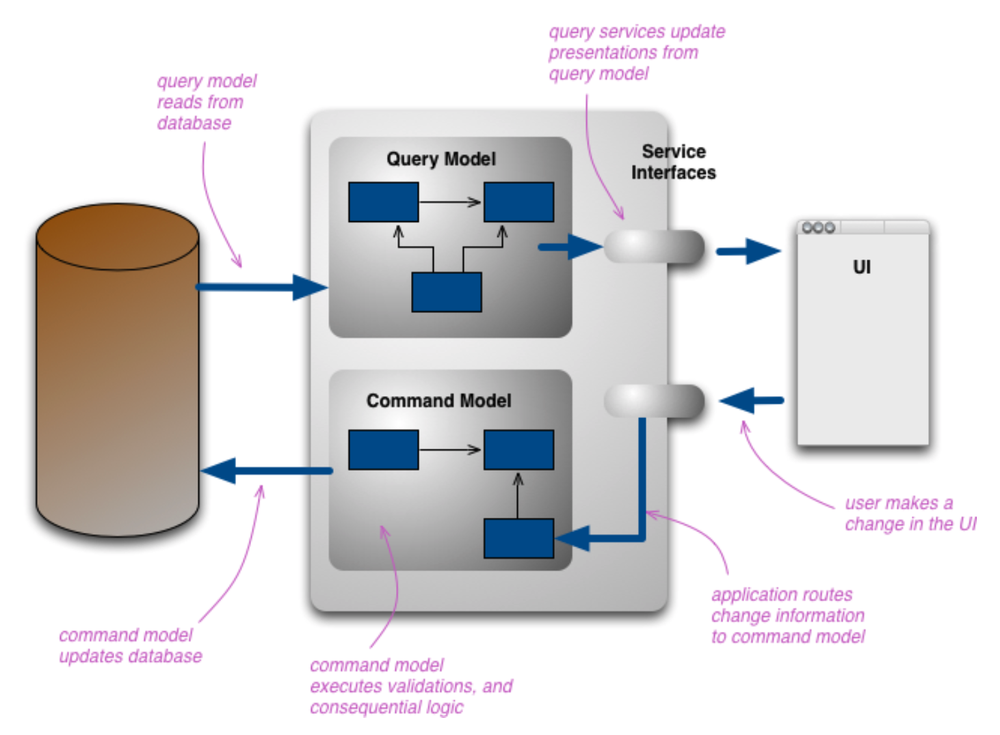

# 단일 모델의 단점

- 조회 회면의 특성상 조회 속도가 빠를수록 좋기 때문에 데이터를 가져오는 방법을 고민해야 한다.
    - 한방쿼리로 가져오면 빠를 수 있는데, JPA의 지연 로딩을 이용하면 N+1 문제로 인해 성능 하락이 일어날 수 있다.
- 도메인 상태를 변경하는데 적합한 객체지향 도메인 모델을 단일 모델로서 읽기 작업에도 사용하려고 하면 표현 방식이 일치하지 않아 구현이 복잡해 질 수 있다.
- 상태 변경을 위한 모델과 조회를 위한 모델을 분리하여 복잡도를 낮출 수 있다.

## CQRS

- 상태를 변경하는 명령을 위한 모델과 상태를 제공하는 조회를 위한 모델을 분리하는 패턴이다.
- e.g. 주문
    - 명령: 주문 생성, 배송지 정보 변경
    - 조회: 주문 상세내역 조회, 판매 통계 보기
- 상태를 변경하는 범위와 상태를 조회하는 범위가 정확하게 일치하지 않기 때문에 단일 모델로 두 종류의 기능을 구현하면 모델이 불필요하게 복잡해진다.
    - 도메인 모델 관점에서 상태 변경 기능은 주로 한 애그리거트의 상태를 변경한다.
    - 조회 기능은 두 개 이상의 애그리거트 데이터를 조합하여 보여줄 수 있다.
- CQRS는 복잡한 도메인에 적합하다.
    - 명령 기능과 조회 기능을 단일 모델로 처리했을 때 조회 기능의 로딩 속도를 위해 모델 구현이 필요 이상으로 복잡해지는 경우에 적합하다.
- CQRS를 이용하면 각 모델에 맞는 구현 기술을 선택할 수 있다.
    - e.g. 명령 모델은 JPA를 이용하고, 조회 모델은 MyBatis를 이용한다.
    - e.g. 명령 모델은 트랜잭션을 지원해주는 RDBMS를 이용하고, 조회 모델은 조회 성능이 좋은 메모리 기반 NoSQL을 이용한다.
- 조회 기능은 응용 로직이 복잡하지 않아 서비스 레이어가 불필요할 수 있다.
- 두 데이터 저장소간의 데이터 동기화는 이벤트를 활용하여 처리한다.
    - 명령 모델에서 상태 변경 → 상태 변경됨 이벤트 발생 → 이벤트를 조회 모델에 전달하여 변경 내역을 반영
    - e.g. 주문 생성 명령이 들어오면 주문을 생성 → 주문 생성됨 이벤트가 발생 → 주문 상세내역 조회 모델, 판매 통계 모델 업데이트
- 명령 모델과 조회 모델이 서로 다른 데이터 저장소를 이용하면 동기화 시점에 따라 구현 방법이 달라질 수 있다.
    - 조회 모델에 바로 반영되어야 하는 경우 동기 이벤트와 글로벌 트랜잭션을 이용하여 실시간 동기화 할 수 있으나, 성능(응답속도, 처리량)이 떨어질 수 있다.
    - 서로 다른 저장소의 데이터를 특정 시간 안에만 동기화 하면 되는 경우에는 비동기로 데이터를 전송해도 된다. 이 때에는 성능이 개선될 수 있다.
        - e.g. 판매 통계를 1시간 단위로 업데이트한다.

## 웹과 CQRS

- 일반적인 웹 서비스는 상태 변경 요청보다 조회 요청이 훨씬 많다.
- 요청 비율이 많은 서비스에서는 조회 성능을 높이기 위해 다양한 방법을 이용한다.
    - e.g. 쿼리 최적화, 인메모리 캐시, 조회 전용 저장소 이용
- 조회 속도를 높이기 위해 명령 모델과 조회 모델을 분리하여 사용하고 있다면 복잡도를 낮추기 위해 명시적으로 구분하는 것이 좋다.

## CQRS 장단점

### 장점

- 명령 모델을 구현할 때 도메인 자체에 집중할 수 있다.
    - 조회 성능을 개선하기 위한 코드가 명령 모델에 들어가지 않는다.
    - 조회 관련 기능이 명령 모델에서 사라져 복잡도가 낮아진다.
- 조회 성능을 향상시키는 데 유리하다.
    - 조회 단위로 캐시 기술을 적용할 수 있다.
    - 조회에 특화된 쿼리를 마음대로 사용할 수 있다.
    - 조회 전용 저장소를 이용하면 조회 처리량을 대폭 늘릴 수 있다.
    - 조회 성능을 높이기 위한 코드가 명령 모델에 영향을 주지 않는다.

### 단점

- 구현해야 할 코드가 많아진다.
    - 단일 모델을 이용할 때와의 비용을 비교 후 도입을 고려해야 한다.
- 더 많은 구현 기술이 필요하다.
    - e.g. 명령 모델에 JPA, 조회 모델에 MyBatis를 사용하면 개발자가 둘 다 사용할 줄 알아야 한다.
    - e.g. RDBMS와 NoSQL을 모두 사용하는 경우 두 저장소의 특성 차이를 이해하고 있어야 한다.
    - e.g. 데이터 동기화를 이용하기 위해 메시징 시스템을 이용하는 경우 해당 기술에 대한 지식이 있어야 한다.

# 참고 링크

[[번역] 마틴 파울러 CQRS 포스팅](https://medium.com/@joohotheman/%EB%B2%88%EC%97%AD-%EB%A7%88%ED%8B%B4-%ED%8C%8C%EC%9A%B8%EB%9F%AC-cqrs-%ED%8F%AC%EC%8A%A4%ED%8C%85-245c63bb1e58)

[CQRS 패턴은 무엇 인가요? - Azure Architecture Center](https://docs.microsoft.com/ko-kr/azure/architecture/patterns/cqrs)