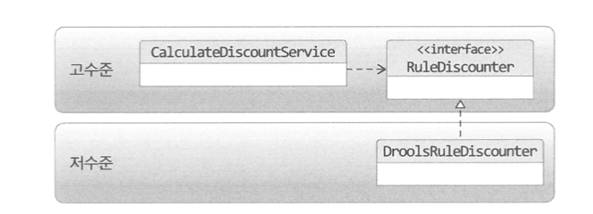

# e.g. 가격 할인 계산 서비스


- 가격 할인 계산이라는 고수준의 모듈을 개발하려면 여러가지 하위 기능이 필요하다.
    - 데이터베이스로부터 고객 정보 가져오기
    - 할인 금액 계산 룰을 실행하기
- 저수준 모듈은 하위 기능을 실제로 구현한 것이다.
    - JPA로 고객 정보를 읽어오는 모듈
    - Drools로 할인 금액 계산 룰을 적용하는 모듈
- 테스트 어려움, 구현 변경의 어려움 문제를 극복하기 위해 DIP를 이용할 수 있다.
    - Drools로 룰을 적용하는 모듈을 직접 사용하지 않고 인터페이스로 추상화하여 의존관계를 역전시킴

## Rule Engine을 직접 의존하는 코드 예시

```java
public class DroolsRuleEngine {
	private KieContainer kContainer;

	public void evalute(String sessionName, List<?> facts) {
		...
	}
}
```

```java
public class CalculateDiscountService {
	private DroolsRuleEngine ruleEngine;

	public Money calculateDiscount(OrderLine orderLines, String customerId) {
		Customer customer = findCusotmer(customerId);
		MutableMoney money = new MutableMoney(0);
		facts.addAll(orderLines);
		ruleEngine.evalute("discountCalculation", facts);
		return money.toImmutableMoney();
	}
}
```

## DIP를 적용하여 개선한 코드



```java
public interface RuleDiscounter {
	public Money applyRules(Customer customer, List<OrderLine> orderLines);
}
```

```java
public class CalculateDiscountService {
	private CustomerRepository customerRepository;
	private RuleDiscounter ruleDiscounter;

	public Money calculateDiscount(OrderLine orderLines, String customerId) {
		Customer customer = customerRepository.findCusotmer(customerId);
		return ruleDiscounter.applyRules(customer, orderLines);
	}
}
```

```java
public class DroolsRuleDiscounter implements RuleDiscounter{
	private KieContainer kContainer;

	@Override
	public void applyRules(Customer customer, List<OrderLine> orderLines) {
		...
	}
}
```
