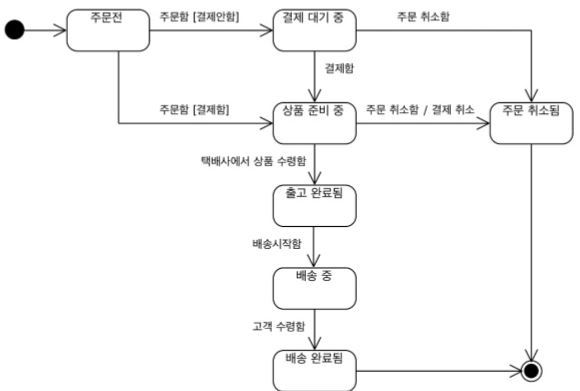

# 1장 도메인 모델 시작

# 도메인

- 소프트웨어로 해결하고자 하는 문제 영역이다.
    - e.g. 온라인 서점 도메인, 코인 거래 도메인
- 한 도메인은 하위 도메인으로 나눌 수 있다.
    - e.g. 서점 주문
        - 주문 도메인: 고객의 주문 처리
        - 혜택 도메인: 쿠폰, 특별 할인 등의 서비스 제공
        - 배송: 고객이 구매한 상품을 전달
- 도메인이 제공해야 하는 기능을 모두 직접 구현할 필요가 없다.
    - e.g. 결제 도메인은 외부 PG사 API를 연동하여 구현할 수 있다.
    - e.g. 배송 도메인은 외부 배송사 API를 연동하여 구현할 수 있다.
    - e.g. 쿠폰 도메인은 외부 기프티콘 API를 연동하여 구현할 수 있다.
- 도메인마다 고정된 하위 도메인이 존재하는 것은 아니다.
    - e.g. 소규모 업체에서는 엑셀 등으로 정산을 수작업 처리할 수 있다.
    - e.g. B2B 업체에서는 웹에서 카탈로그만 제공하고 결제는 대면 계약을 통해 진행할 수 있다.
        - but 일반 사용자를 대상으로 하는 B2C 서비스라면 결제를 위한 도메인이 필요할 것이다.

# 도메인 모델

- 특정 도메인을 개념적으로 표현한 것이다.
- 여러 관계자들이 동일한 모습으로 도메인을 이해하고 도메인 지식을 공유하는 데 도움이 된다.

객체 기반 주문 도메인 모델

- 도메인을 표현하는 방식으로 객체를 이용할 수 있다.
    - 객체를 이용하면 도메인이 제공하는 **기능**과 도메인의 **주요 데이터 구성**을 표현하기 용이하다.

상태 다이어그램을 이용한 주문 상태 모델링

- 반드시 객체로만 모델링 할 필요는 없다. 도메인을 이해하는 데 도움이 된다면 어떤 표현방식을 사용하든 중요하지 않다.
    - e.g. 클래스 다이어그램, 상태 다이어그램, 수학 공식, 그래프 ...
- 도메인 자체를 이해하기 위한 **개념 모델**이다.
- 개념 모델로 바로 코드를 작성할 수는 없어 구현 기술에 맞는 **구현 모델**이 필요하다.

## 하위 도메인과 모델

- 도메인은 다수의 하위 도메인으로 구성된다.
- 하위 도메인에서 동일한 용어를 사용하더라도 다른 의미로 해석될 수 있다.
    - e.g.
        - 카탈로그 도메인의 상품: 상품 가격, 상품 설명을 담고있는 정보
        - 배송 도메인의 상품: 고객에게 실제 배송되는 물리적인 상품
- 도메인에 따라 용어의 의미가 달라질 수 있으므로 여러 하위 도메인을 하나의 다이어그램에 모델링하면 안된다.

# 도메인 모델 패턴

## 아키텍처 구성

- 크게 네 개의 계층으로 구성된다.

### ui (=presentation)

- 사용자의 요청을 처리한다.
- 사용자에게 정보를 보여준다.

### application

- 사용자가 요청한 기능을 실행한다.
- 비즈니스 로직을 직접 구현하지 않는다.
- 도메인 계층을 조합해서 기능을 실행한다.

### domain

- 시스템이 제공할 도메인의 규칙(비즈니스 로직)을 구현한다.

### infrastructure

- DB 또는 메시징 시스템과 같은 **외부 시스템**과의 연동을 처리한다.

## 도메인 모델

- 아키텍처 상의 도메인 계층을 객체 지향 기법으로 구현하는 패턴이다.
- e.g. 주문 도메인의 도메인 규칙
    - 출고 전에 배송지를 변경할 수 있다.
    - 주문 취소는 배송 전에만 할 수 있다.
- 핵심 규칙을 구현한 코드는 도메인 모델에만 위치하기 때문에 규칙이 바뀌거나 규칙을 확장해야 할 때 다른 코드에 영향을 덜 주고 변경 내역을 모델에 반영할 수 있게 된다.
- 도메인 자체를 표현하는 **개념적 모델**을 지칭할 때도 사용되고, **구현할 때 사용하는 객체 모델**을 지칭할 때도 사용된다.

### 개념 모델? 구현 모델?

**개념 모델**

- 순수하게 문제를 분석한 결과물이다.
- 구현 기술과 관련된 것들을 고려하지 않는다.
- 실제 코드를 작성할 때는 개념 모델과의 불일치가 발생할 수 있어 구현 가능한 모델로 전환하는 과정을 거친다.
    - 참고 영상: [https://youtu.be/dXRX-RT2lVg](https://youtu.be/dXRX-RT2lVg)
- 개발 초기부터 완벽한 도메인 모델을 만들 수 없다.

    → 프로젝트를 진행하면서 도메인 지식이 쌓이고, 새로운 통찰을 얻으면서 모델을 보완하거나 수정해야 하는 일이 발생한다.

    → 그러므로 전반적인 개요를 알 수 있는 수준으로 개념 모델을 작성해야 한다.

    → 개념 모델로 도메인에 대한 전체 윤곽을 이해하는데 집중 → 구현 과정에서 개념 모델을 구현 모델로 점진적으로 발전시키기

# 도메인 모델 도출

- 구현을 시작하기에 앞서 반드시 도메인에 대한 초기 모델을 만들어야 한다. (화이트보드, 모델링 툴, 등 여러가지 수단 이용)
    - e.g. StarUML, Draw.io, PlantUML 등의 도구 이용
- 도메인 모델링 기본 작업은 다음과 같다.
    - 핵심 구성요소 찾기 ⇒ 인스턴스 변수
    - 규칙 찾기 ⇒ 메서드 내 비즈니스 로직
    - 기능 찾기 ⇒ 메서드
- 위 항목들은 요구사항으로부터 도출할 수 있다.

### 문서화

- 지식을 공유하기 위해 작성한다.
- 전반적인 기능 목록이나 모듈 구조, 빌드 과정은 상위 수준에서 구현보다 상위 수준에서 정리한 문서를 참조하는 것이 소프트웨어 전반을 이해하는 데 도움이 된다.
- 코드 자체도 문서화의 대상이다.
    - 도메인 관점에서 코드가 도메인을 잘 표현해야 비로소 코드의 가독성이 높아지며 문서로서 코드가 의미를 갖는다.

# 엔티티, 밸류

- 도출한 모델을 분류하는 두 가지 형태이다.

## 엔티티

- 각 엔티티는 서로 다른 식별자(id)를 갖는다.
    - e.g. 각 주문은 다른 식별자를 갖는다.
- 엔티티에 부여된 식별자는 바뀌지 않는다.
    - = 두 엔티티의 식별자가 같으면 두 엔티티는 같다.
    - = equals 구현시 식별자만 가지고 엔티티의 동등성 여부를 판단한다.
    - = hashCode 구현시 식별자만 해시값 계산 로직에 포함되어야 한다.

### 식별자 생성

- 도메인의 특징과 사용하는 기술에 따라 생성 방식이 달라진다.
- 일반적으로 다음 중 하나의 방식으로 생성된다.
    - 특정 규칙에 따라 생성
        - e.g. 주문번호, 운송장번호, 카드번호
        - 규칙상 같은 식별자가 만들어지지 않도록 주의해야 한다.
    - UUID 사용
    - 값을 직접 입력
        - 사용자의 아이디, 이메일
        - 중복 입력시 생성되지 않도록 방지해야 한다.
    - 일련번호 사용 (sequence, DB 자동 증가 컬럼 사용)
        - 주로 사용하는 방식이다.
        - e.g. MYSQL의 auto_increment
        - DB 자동 증가 컬럼을 이용하면 Repository가 DB가 생성한 식별자를 구해서 엔티티 객체에 반영한다.
        - 자동 증가 컬럼은 영속화가 되야 식별자를 알 수 있다.

## 밸류

- 개념적으로 완전한 하나를 표현할 때 사용한다.
    - e.g. 주소: 시군구/시도/상세주소/우편번호
    - e.g. 상품 수신자: 이름, 연락처
- 두 개 이상의 값 뿐만 아니라 코드의 이해도를 높이기 위해 하나의 값을 표현할 때도 사용할 수 있다.
    - e.g. 금액과 관련된 부분에 Money 타입을 정의한다.
- 밸류 타입을 정의하면 밸류 타입을 위한 기능을 추가할 수 있다.
    - e.g. 돈 계산을 위한 기능
- 밸류 객체의 데이터를 변경할 때는 기존 데이터를 변경하기보다 변경한 값을 갖는 새로운 객체를 만드는 방식을 선호한다.
    - 불변 타입을 사용함으로써 안전한 코드를 작성할 수 있다.
    - = 같은 reference를 가지는 객체에 영향을 주지 않는다.
- equals 구현시 모든 속성이 같은지 비교해야 한다.
- hashCode도 마찬가지로 모든 속성이 해시값 계산 로직에 포함되어야 한다.

## 엔티티 식별자와 밸류 타입

- 식별자가 도메인 내에서 특별한 의미를 가지면 밸류 타입으로 만들 수 있다.
    - e.g. 주문번호

## 도메인 모델에 set 메서드 넣지 않기

- 도메인 객체가 불완전한 상태로 사용되는 것을 막기 위해 생성자를 통해 필요한 모든 데이터를 받아야 한다.
    - 생성자로 필요한 것을 모두 받으면 생성자 호출 시점에 필요한 데이터가 올바른지 여부를 판별할 수 있다.
- 밸류 타입을 사용하면 불변성을 보장하기 위해 set 메서드를 사용하지 않는다.
- 과거 프레임워크에서는 private 필드에 값을 할당할 마땅한 방법이 없어서 getter, setter를 뚫어 썼는데, 최근 프레임워크에서는 set 메서드가 없더라도 private 필드에 값을 할당할 수 있다.

# 도메인 용어

- 도메인에서 사용하는 용어를 코드에 반영하지 않으면 개발자는 코드의 의미를 직관적으로 확인할 수 없고 해석해야 한다.
