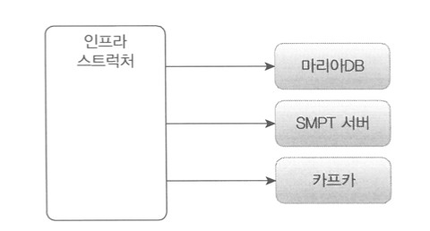
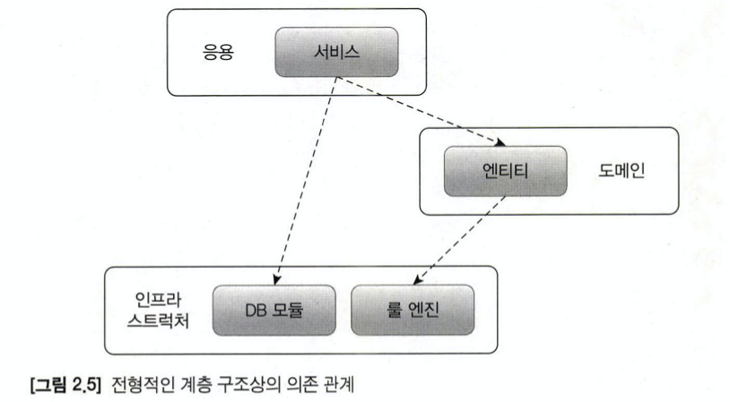
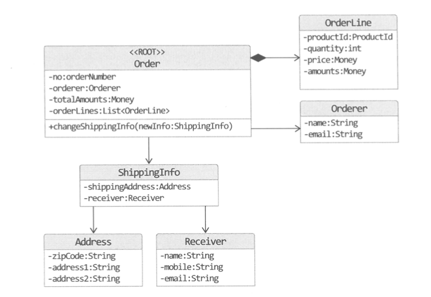

# 2장 아키텍처 개요

# 네 개의 영역

크게 Presentation, Application, Domain, Infrastructure 영역으로 구분된다.

## Presentation


- 사용자의 요청을 받아 응용 영역에 전달하고 응용 영역의 처리 결과를 다시 사용자에게 보여주는 역할을 수행한다.
    - HTTP 요청을 응용 역역이 필요로 하는 형식으로 변환하여 응용 영역에 전달한다.
        - HTTP StartLine, Header, Body을 파싱하여 전달
    - 응용 영역의 응답을 HTTP 응답으로 변환해서 전송한다.
        - Service Layer에서 응답 DTO를 구성하여 컨트롤러에서 ResponseEntity로 반환하면 리턴 결과를 JSON 형식으로 변환하여 HTTP 응답으로 클라이언트에 전송
- e.g. Spring MVC
- 사용자는 웹 브라우저를 사용하는 사용자일 수도 있고, REST API를 호출하는 외부 시스템일 수도 있다.

## Application


- 시스템이 사용자에게 제공해야 할 기능을 구현한다.
    - e.g. 주문 등록, 주문 취소, 상품 상세 조회
- 기능을 구현하기 위해 도메인 영역의 도메인 모델을 사용한다.
    - e.g. 주문 도메인 모델을 사용한 기능 구현

    ```java
    public class CancelOrderService {
    	@Transactional
    	public void cancelOrder(String orderId) {
    		Order order = findOrderById(orderId)
    				.orElseThrow(() -> new OrderNotFoundException(orderId));
    		order.cancel(); // 주문 취소 로직을 도메인 로직에 위임
    	}
    }
    ```

- 응용 서비스는 로직을 직접 수행하기 보다는 도메인 모델에 로직 수행을 위임한다.

## Domain

- 도메인 모델을 구현한다.
    - e.g. 1장의 Order, OrderLine, ShippingInfo 등...
- 도메인 모델은 도메인의 핵심 로직을 구현한다.
    - e.g. 주문 도메인 → 배송지 변경, 결제 완료 처리, 주문 총액 계산 등...

## Infrastructure



- 논리적인 개념을 표현하기 보다는 실제 구현을 다룬다.
- e.g.
    - RDBMS 연동
    - Messaging Queue에 메시지 전송 및 수신
    - MongoDB, HBase 등을 사용하여 데이터베이스 연동 처리
    - SMTP를 이용한 메일 발송 기능 구현
    - HTTP 클라이언트를 이용하여 REST API 호출
- 도메인, 응용, 표현 계층에서는 구현 기술을 직접 사용하지 않고 인프라스트럭처 영역에서 제공하는 기능을 사용하여 필요한 기능을 구현한다. 즉, 기술과 직접적으로 연관된 부분은 도메인, 응용, 표현 계층에 노출되지 않는다. (=인프라스트럭처를 제외한 다른 레이어는 기술에 종속적이지 않다.)

# 계층 구조 아키텍처


- 계층 구조는 특성상 상위 계층에서 하위 계층으로의 의존만 존재하고, 하위 계층은 상위 계층에 의존하지 않는다.
    - e.g. 표현 계층은 응용 계층에 의존하지 않는다.
    - e.g. 응용 계층이 도메인 계층에 의존하지만, 인프라스트럭처 계층이 도메인에 의존하거나 도메인이 응용 계층에 의존하지는 않는다.
- 계층구조를 엄격하게 지키려면 상위 계층이 바로 하위 계층에만 의존을 가져야 한다. 하지만, 구현의 편의를 위해 계층 구조를 유연하게 적용한다.
- 응용 계층은 도메인 계층에 의존하지만, 외부 시스템과의 연동을 위해 인프라스트럭처 계층에 의존하기도 한다.

    

- 위와 같은 구조에서는 표현, 응용, 도메인 계층이 인프라스트럭처에 의존적인 구조가 될 수 있다.
    - e.g. 할인 금액 계산이 복잡한 경우 룰 엔진에서 처리
    - 인프라스트럭처에 의존적인 경우 특정 레이어만 테스트하기 어렵다.
        - e.g. 할인 금액을 계산하기 위한 엔진이 완벽히 동작해야만 할인 금액 계산 서비스를 테스트 할 수 있다.
    - 인프라스트럭처에 직접적인 의존을 가지고 있으면 구현 방식을 변경하기 어렵다.
        - e.g. 할인 금액을 계산하기 위한 엔진을 변경해야 할 때 해당 엔진을 의존하고 있는 모든 코드를 수정해야 한다.
    - DIP를 이용하여 위 두 가지 문제를 해결할 수 있다.

# DIP

[e.g. 가격 할인 계산 서비스](ks_kim/가격_할인_계산_서비스.md)


- 저수준 모듈이 고수준 모듈에 의존하도록 바꾸는 원칙이다.
- 인터페이스로 상세 구현을 추상화하여 어떤 기술을 사용했는지 직접 드러내지 않음으로써 특정 기술에 대한 의존성을 제거할 수 있다.
- 실제 구현 객체는 런타임에 생성자를 통해 전달받기 때문에 구현의 내용을 몰라도 무방하다.
- 구현체가 없더라도 테스트 하기 용이해진다.
    - e.g. mock, fake 등의 가짜 객체 이용
    - 물론, 테스트 더블을 하는것이 적절한지에 대해서는 갑론을박이 있지만 이 곳에서의 주제는 아니므로 생략한다.
- 구현 방식을 변경하기 쉬워진다.
    - e.g. 이메일 전송 방식을 SpringMailSender에서 AWS SES API 호출로 변경
- 저수준 구현 객체를 생성하는 부분의 코드만 변경하면 고수준 객체에서는 변경이 이루어지지 않는다.
- 같이 의존 관계 주입을 지원해주는 프레임워크를 사용한다면 설정 코드 변경만으로 간단하게 주입 대상을 변경할 수 있다.
    - e.g. Spring프레임워크 IoC 컨테이너
    - e.g. Node.js Inversify
    - e.g. Nest.js 프레임워크
    - e.g. Android Koin, Dagger2

## DIP 주의사항

- 단순히 인터페이스와 구현 클래스를 분리하는 것이 아닌, 고수준의 모듈이 저수준 모듈에 의존하지 않도록 하는 것이다.


잘못된 DI 적용 예시


개선한 DI 적용 예시

- 첫 이미지에서 도메인 영역이 인프라스트럭처에 의존하고 있으므로 여전히 고수준의 모듈이 저수준에 의존하고 있는 것이다.
- 두 번째 이미지에서 추상화한 인터페이스를 고수준인 도메인 모듈 관점에서 도출함으로써 DIP를 실현하고 있다.

## DIP와 아키텍처

- 저수준의 인프라스트럭처 계층에 DIP를 적용하면 다음과 같이 고수준 계층에 의존하는 형태가 된다.


- 고수준에 정의된 인터페이스를 상속받아 구현하는 구조가 되므로 고수준 모듈의 변경을 최소화하면서 구현 기술을 유연하게 바꿀 수 있게 된다.


- SMS 알림도 추가되어야 한다면 Notifier를 상속하는 CompositeNotifier 구현체를 만들어 교체할 수 있다.
- Jpa로 변경하고자 한다면 OrderRepository를 상속하는 JpaOrderRepository 구현체를 만들어 교체할 수 있다.

# 도메인 영역의 주요 구성요소

아래 구성요소는 에릭 에반스의 책 "도메인 주도 설계"에서 소개한 패턴에 기반하고 있다.

### 엔티티

- 고유의 식별자를 갖는 객체로, 자신의 라이프사이클을 갖는다.
- e.g. 주문, 상품과 같은 도메인의 고유한 개념
- 도메인 모델의 데이터를 포함하며, 해당 데이터와 관련된 기능을 함께 제공한다.
- DB 관계형 모델의 엔티티와 실제 도메인 모델의 엔티티는 같은 것이 아니다.
- 둘의 가장 큰 차이점은, 데이터와 함께 도메인 기능을 제공하는지 여부이다.
    - e.g. 주문 엔티티는 배송지 주소 변경, 주문 취소 기능을 제공한다.
- 도메인 모델의 엔티티는 도메인 관점에서 기능을 구현하고 기능 구현을 캡슐화하여 데이터가 임의로 변경되는 것을 막는다.
- 도메인 모델의 엔티티는 두 개 이상의 데이터가 개념적으로 하나인 경우 밸류 타입을 이용해서 표현할 수 있다.
    - e.g. 주문 도메인에서 (이름+닉네임)을 orderer라는 하나의 개념으로 표현할 수 있다. 두 값이 일치하면 논리적 동치가 성립한다.

### 밸류

- 고유의 식별자를 갖지 않는 객체이다.
- 개념적으로 하나인 도메인 객체의 속성을 표현할 때 사용한다.
- e.g. 배송지 주소, 구매금액 타입
- 엔티티의 속성으로 사용될 뿐만 아니라 다른 밸류 타입의 속성으로도 사용될 수 있다.
- RDBMS에서는 밸류 타입을 제대로 표현하기 힘들다.
    - 밸류 타입이 별도의 각 컬럼으로 표현되거나, 다른 엔티티로 표현될 뿐이다.
    - json타입을 사용한다면...?
- 불변으로 구현하는 것이 권장된다.
- 값이 변경될 때 객체 자체를 완전히 교체함을 의미한다.

### 애그리거트



- 관련된 엔티티와 밸류 객체를 개념적으로 하나로 묶은 것이다.
- e.g. 주문 애그리거트 = Order 엔티티 + 주문 목록인 OrderLine 밸류 + 주문자 Orderer 밸류
- e.g. 주문 = 주문 + 배송지 정보 + 주문자 + 주문 목록 + 총 결제금액
- 애그리거트를 사용하면 관련 하위 객체를 묶어 객체 군집 단위로 모델을 바라볼 수 있다.
- 개별 객체관계가 아닌 애그리거트 간 관계로 도메인 모델을 이해하고 구현, 관리할 수 있다.
- 애그리거트는 군집에 속한 객체를 관리하는 루트 엔티티를 갖는다.
- 루트 엔티티는 애그리거트에 속한 엔티티와 밸류 객체를 이용하여 애그리거트가 구현해야 할 기능을 제공한다.
- 애그리거트 루트를 통해서 간접적으로 애그리거트 내 다른 엔티티나 밸류 객체에 접근할 수 있도록 함으로써 애그리거트 단위로 캡슐화 할 수 있다.
    - e.g. 주문 애그리거트에서 배송지 정보 변경 기능은 애그리거트 내에서 배송지를 변경할 수 있는 상태인지 확인 후 변경한다.
- 애그리거트 구성에 따라 구현이 복잡해지기도 하고, 트랜잭션 범위가 달라지기도 한다.
- 선택한 구현 기술에 따라 애그리거트 구현에 제약이 생기기도 한다.

### 리포지터리


- RDBMS, NoSQL, 로컬 파일과 같은 물리적인 저장소에 데이터를 저장하기 위한 도메인 모델이다.
- e.g. DBMS 테이블에서 엔티티 객체를 로딩하거나 저장하는 기능 제공
- 엔티티, 밸류 ⇒ 요구사항에서 도출되는 도메인 모델 / 리포지터리 ⇒ 구현을 위한 도메인 모델
- 애그리거트 단위로 도메인 객체를 저장하고 조회하는 기능을 정의한다.
- 도메인 모델을 사용해야 하는 코드는 리포지터리를 통해 도메인 객체를 구한 뒤 도메인의 기능을 실행한다.
- e.g. 주문 취소를 위한 로직

    ```java
    public class CancelOrderService {
    	private OrderRepository orderRepository;

    	public CancelOrderService(OrderRepository orderRepository) {
    		this.orderRepository = orderRepository;
    	}
    	
    	@Transactional
    	public void cancelOrder(String orderId) {
    		Order order = findOrderById(orderId)
    				.orElseThrow(() -> new OrderNotFoundException(orderId));
    		order.cancel(); // 주문 취소 로직을 도메인 로직에 위임
    	}
    }
    ```

- 도메인 모델 관점에서 Repository는 도메인 객체를 영속화하는데 필요한 기능을 추상화한 것으로 고수준 모듈에 속한다.
- Repository를 구현한 클래스는 저수준 모듈로, 인프라스트럭처 영역에 속한다.
- 응용 서비스와 리포지터리 간 밀접한 연관이 있다.
    - 응용 서비스는 필요한 도메인 객체를 구하거나 저장할 때 리포지터리를 이용한다.
    - 응용 서비스는 트랜잭션을 관리하는데, 트랜잭션 처리는 리포지터리 구현 기술에 영향을 받는다.
- `save(aggregate)`, `findById(id)`, `delete(id)`, `counts()` 등의 기능을 제공한다.
- 구현 방법은 선택한 구현 기술에 따라 달라진다. (Data JPA, Data JDBC, MyBatis ...)

### 도메인 서비스

- 특정 엔티티에 속하지 않은 도메인 로직을 제공한다.
- e.g. 할인 금액 계산은 상품, 쿠폰, 회원 등급, 구매 금액 등 다양한 조건을 이용해야 한다. 여러 엔티티와 밸류를 필요로 하므로 도메인 서비스에서 로직을 구현한다.

# 요청 처리 흐름


- 표현 영역
    - 사용자가 전송한 데이터 형식이 올바른지 검사한다.
    - 사용자가 전송한 데이터를 응용 서비스가 요구하는 형식으로 변환하여 전달한다.
        - HTTP 요청 파라미터를 응용 서비스가 필요로 하는 데이터로 변환한다.
    - 응용 서비스에 기능 실행을 위임한다.
- 응용 서비스
    - 리포지터리에서 필요한 도메인 객체를 가져온다.
    - 도메인 모델을 이용해서 기능을 구현한다.
    - 신규 도메인 객체를 생성하여 리포지터리에 저장한다.
    - 도메인의 상태를 변경하는 경우 변경 상태가 물리 저장소에 올바르게 반영되도록 트랜잭션을 관리해야 한다.

# 인프라스트럭처 개요

- 표현 영역, 응용 영역, 도메인 영역을 지원한다.
- 도메인 객체의 영속성 처리, 트랜잭션, SMTP 클라이언트, REST 클라이언트 등 다른 영역에서 필요로 하는 프레임워크, 구현 기술, 보조 기능을 지원한다.
- 구현 기술을 도메인/응용 영역에서 직접 실행하는 것보다 DIP를 통해 추상화를 거치는 것이 변경에 유연하며 테스트 용이하다.
- 무조건적으로 인프라스트럭처에 대한 의존을 없애는 것이 능사는 아니다.
    - 스프링을 사용하는 경우 `@Transactional`을 사용하여 트랜잭션을 처리할 수 있다.
    - JPA를 사용하는 경우 도메인 모델 객체에 `@Entity`, `@Column`등의 JPA 전용 어노테이션을 사용하는 것이 매핑 설정을 분리하는 것보다 편리하다.
    - DIP의 장점을 해치지 않는 선에서 기술에 대한 의존을 가져가는 것이 현명하다.
    - 스프링 의존 어노테이션, JPA 의존 어노테이션을 사용함으로써 얻는 장점과 단점을 잘 판단하여 적용하는 것이 좋다.

# 모듈 구성

- 아키텍처의 각 영역은 별도 패키지에 위치한다.
- 패키지 구성에는 한 개의 정답만 있는것이 아니지만 아래와 같이 다양한 방식으로 구성할 수 있다.


계층 중심적인 패키지 분류


도메인 중심적인 패키지 분류: 도메인이 큰 경우 하위 도메인별로 모듈을 나눈다.


하위 도메인을 하위 패키지로 구성한 모듈 구조

- e.g. 카탈로그 하위 도메인을 위한 도메인이 상품 애그리거트와 카테고리 애그리거트로 구성되는 경우 위와 같이 두 개의 하위 패키지로 구성할 수 있다.
- 각 애그리거트와 모델과 리포지터리는 같은 패키지에 위치시킨다.
    - e.g. com.myshop.order.domain → Order, OrderLine, Orderer, OrderRepository
- 도메인이 복잡하면 도메인 모델과 도메인 서비스를 다음과 같이 별도 패키지에 위치시킬 수 있다.
    - com.myshop.order.domain.order: 애그리거트 위치
    - com.myshop.order.domain.service: 도메인 서비스 위치
- 응용 서비스도 다음과 같이 도메인 별로 패키지를 구분할 수 있다.
    - com.myshop.catalog.application.product
    - com.myshop.catalog.application.category
- 모듈 구조를 얼마나 세분화 하는지에 대한 규칙은 없다.
- 한 패키지에 너무 많은 타입이 몰려 코드를 찾기 불편한 정도만 아니면 된다.
- 가능한 한 패키지에 10개 미만으로 타입 개수를 유지하는 것이 편리하다. 그 이상이 되면 분리를 고려한다.

# 참고 링크

- 어떠한 경우에 interface를 추출할 것인가?

[안정된 의존관계 원칙과 안정된 추상화 원칙에 대하여 - 우아한형제들 기술 블로그](https://woowabros.github.io/study/2018/03/05/sdp-sap.html)
