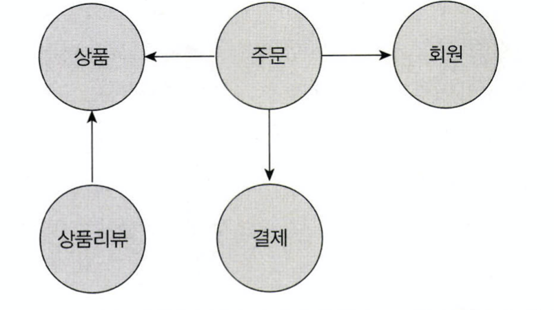
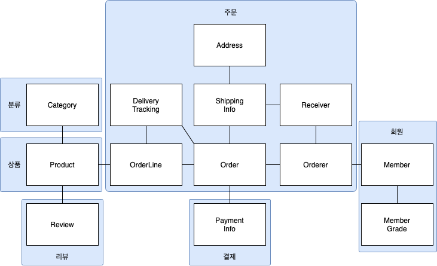
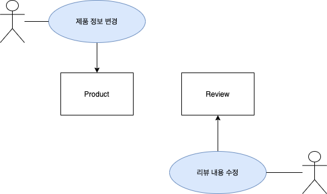

# 3장 애그리거트

# 애그리거트



- 테이블이 점점 많아질수록 하나의 ERD에서 표현했을 때 구조를 이해하기 어려워진다.
- 복잡한 도메인을 이해하고 관리하기 쉬운 단위로 만들려면 상위 수준에서 모델을 조망할 수 있는 방법이 필요한데, 그 방법이 애그리거트이다.



- 애그리거트는 관련된 객체를 하나의 군으로 묶어준다.
- 애그리거트는 모델을 이해하는 데 도움을 줄 뿐만 아니라 일관성을 관리하는 기준이 된다.
- 복잡한 도메인을 단순한 구조로 만들어 줘 도메인 기능을 확장하고 변경하는 데 필요한 노력을 줄여준다.
- 하나의 애그리거트에 속한 객체는 유사하거나 동일한 라이프사이클을 갖는다.
- 애그리거트는 경계를 갖는다.
    - 한 애그리거트에 속한 객체는 다른 애그리거트에 속하지 않는다.
    - 각 애그리거트는 자기 자신을 관리할 뿐, 다른 애그리거트를 관리하지 않는다.
    - e.g. 주문 애그리거트에서는 주문과 관련된 사항만 변경하지, 고객 비밀번호를 변경하는 경우는 없다.
- 경계를 설정할 때 기본이 되는건 도메인 규칙과 요구사항이다.
    - 도메인 규칙에 따라 함께 생성되는 구성요소는 한 애그리거트에 속할 가능성이 높다.
        - e.g. 주문 상품 수, 배송지, 주문자
    - 함께 변경되는 빈도가 높은 객체는 한 애그리거트에 속할 가능성이 높다.
        - e.g. 주문 상품 수를 변경하면 주문 총액이 변경되어야 한다.



- A가 B를 갖는 구조라고 해서 하나의 애그리거트에 속한다고 볼 수 없다.
- e.g. 상품과 리뷰의 관계
    - 상품 생성시 리뷰가 같이 생성되지 않는다.
    - 리뷰 변경이 상품에 영향을 주지 않고, 상품 변경이 리뷰에 영향을 주지 않는다.
- 도메인에 대한 지식이 쌓일수록 애그리거트의 크기는 작아지고, 일반적으로 한 개의 엔티티 객체만 갖는 경우가 많다.

# 애그리거트 루트


- 애그리거트에 속한 모든 객체가 일관된 상태를 유지하기 위해 애그리거트를 관리하는 주체이다.
- 애그리거트에 속한 객체는 애그리거트 루트 엔티티에 직접 또는 간접적으로 속한다.

## 도메인 규칙과 일관성

- 애그리거트 루트가 제공하는 메서드는 도메인 규칙에 따라 애그리거트에 속한 객체의 일관성이 깨지지 않도록 구현해야 한다.
    - e.g. 배송이 시작되기 전까지만 배송지 정보를 변경할 수 없으면, 규칙에 따라 배송 시작 여부를 확인하고 변경이 가능한 경우에만 배송지 정보를 변경해야 한다.
- 애그리거트 루트가 아닌 다른 객체가 애그리거트에 속한 객체를 직접 변경하면 일관성이 꺠질 수 있으므로 허용하면 안된다.
    - e.g. getter로 애그리거트 내 객체를 받아와 애그리거트 루트를 거치지 않고 직접 변경하는 경우
    - 동일한 비즈니스 로직을 중복해서 구현하는 문제도 야기할 수 있다.
- setter를 허용하지 않고, 밸류 타입은 불변으로 구현하여 위 상황을 방지할 수 있다.
    - setter를 허용하지 않으면 객체 내의 값을 변경할 수 없다.
    - 밸류 타입만 허용하면 getter를 이용하여 같은 객체를 가리키더라도 객체의 값을 임의로 변경할 수 없다.

## 애그리거트 루트 기능의 구현

- 애그리거트 내부의 다른 객체를 조합하여 기능을 완성한다.
- 애그리거트 외부에서 상태를 변경할 수 있다면 일관성을 보장하지 못할 수 있다.
    - 애그리거트에 속하는 객체를 불변으로 구현하면 된다.
    - 팀 컨벤션이나 기술적인 문제로 인해 불변 구현이 불가능하다면 변경 기능을 패키지나 protected 범위로 한정하여 외부에서 실행할 수 없도록 제한할 수 있다.

## 트랜잭션 범위

- 트랜잭션 범위는 작을수록 좋다.
- 하나의 트랜잭션에서 다루어야 하는 테이블의 수가 많아질수록 충돌을 방지하기 위한 대상이 많아져 성능은 악화된다.
- 잠금 대상이 많아질수록 동시에 처리할 수 있는 트랜잭션 개수가 줄어든다는 의미이고, 처리량이 떨어진다.
- 한 트랜잭션에서는 한 개의 애그리거트만 수정해야 한다.
- 한 트랜잭션에서 두 개 이상의 애그리거트를 수정하면 트랜잭션 충돌이 발생할 가능성이 높아지고, 처리량도 떨어진다.
- 부득이하게 한 트랜잭션으로 두 개 이상의 애그리거트를 수정해야 한다면 애그리거트에서 다른 애그리거트를 직접 수정하지 말고 응용 서비스에서 두 애그리거트를 수정하도록 구현해야 한다.
- 도메인 이벤트를 사용하면 한 트랜잭션에서 한 개의 애그리거트를 수정하면서 동기나 비동기로 다른 애그리거트의 상태를 변경하는 코드를 작성할 수 있다.
    - 대신, 분산 트랜잭션을 처리하기 위해 2PC, Saga패턴과 같은 것을 적용해야 한다.

# 리포지터리와 애그리거트

- 객체의 영속성을 처리하는 리포지터리는 애그리거트 단위로 존재한다.
    - e.g. OrderLine은 Order라는 애그리거트 루트에 속하므로 OrderLineRepository를 만들지 않는다.
- 애그리거트를 영속화하고 사용하기 위한 최소한의 메서드는 다음과 같다.
    - `save(aggregate)`
    - `findById(aggregateId)`
- 리포지토리 구현 기술에 따라 애그리거트 구현도 영향을 받는다.
    - e.g. JPA에서는 밸류 타입 도메인 모델을 `@Component`가 아닌 `@Entity`를 이용해야 할 수 있다.
- 애그리거트는 개념적으로 하나이므로 리포지터리는 애그리거트 전체를 저장소에 영속화해야 한다.

```java
orderRepository.save(order) // Order와 관련된 OrderLine 등 모든 테이블 데이터가 한꺼번에 저장된다.
```

- 반대로, 애그리거트를 가져올 때는 애그리거트에 포함된 모든 구성요소를 같이 가져와야 한다.

```java
orderRepository.findById(orderId) // Order와 관련된 모든 구성요소(OrderLine, Orderer...)를 가져온다.
```

- RDBMS를 사용하면 트랜잭션을 이용하여 애그리거트의 변경이 저장소에 반영되는 것을 보장할 수 있다.

# ID를 이용한 애그리거트 참조

- 애그리거트는 다른 애그리거트를 참조할 수 있다. (=다른 애그리거트 루트를 참조한다.)

## 객체 참조 이용

- JPA와 같은 기술을 이용하여 객체 참조를 하면 다음과 같은 문제가 발생할 수 있다.

### 편한 탐색 오용

- 다른 애그리거트에 접근할 수 있으면, 변경 또한 가능한데, 이는 관리 범위를 벗어난 행위이다.
- 다른 애그리거트의 상태를 변경하면 애그리거트 간 의존 결합도를 높인다.

### 성능에 대한 고민

- 지연 로딩 / 즉시 로딩 중 어떤 방식을 사용할지 선택해야한다.
- 화면 출력 목적으로 조회를 하는 경우에는 즉시 로딩이 성능상 유리하다.
- 상태를 변경해야 하는 경우에는 불필요한 객체를 매번 불러올 필요가 없으므로 지연 로딩이 유리하다.
- 다양한 경우의 수를 고려하여 JPQL/Criteria 쿼리의 로딩 전략을 결정해야 한다.

### 확장 어려움

- 단일 DBMS로 서비스를 제공하는 경우에는 문제가 발생하지 않는다.
- 부하를 분산하기 위해 하위 도메인별로 시스템을 분리하기 시작할 때, 도메인 별로 서로 다른 DB를 사용할 수 있게 되므로 다른 애그리거트 루트를 참조하기 위해 JPA와 같은 단일 기술을 사용할 수 없다.

## ID 참조 이용

- 애그리거트 간 물리적인 연결을 제거하여 모델의 복잡도를 낮춰준다.
- 애그리거트 간 의존이 제거되어 응집도가 높아진다.
    - 다른 애그리거트의 상태를 변경할 수 없게 된다.
- 다른 애그리거트를 직접 참조하지 않아 구현 복잡도가 낮아진다.
- 다른 애그리거트의 객체를 참조해야 할 때에는 응용 서비스에서 필요한 애그리거트를 로딩하면 된다.
- 애그리거트별로 다른 DB를 사용할 수 있다. RDBMS뿐만 아니라 NoSQL도 사용 가능하다.
- 도메인 별로 프로세스를 따로 띄워 서비스하도록 구현할 수 있다.

## ID를 이용한 참조와 조회 성능

- 한 번에 가져올 수 있는 데이터를 여러번에 걸쳐 가져와 N+1 문제가 발생할 수 있다.
    - 지연 로딩과 같은 문제이다.
    - e.g. 주문과 상품이 있으면 주문 한 건에 속한 N개의 상품을 가져오기 위해 N번의 쿼리 발생
- ID 참조를 하면서 N+1 조회를 방지하기 위해서는 직접 조회 쿼리를 작성하면 된다.
    - 쿼리가 복잡하거나 SQL 특화된 기능을 사용해야 하면 MyBatis같은 기술을 이용하여 실행할 수 있다.
- 애그리거트마다 서로 다른 저장소를 이용하는 경우에는 한방쿼리를 작성할 수 없다.
    - 조회 성능을 높이기 위해 캐시를 적용하거나, 조회 전용 저장소를 따로 구성할 수 있다. (CQRS)

# 애그리거트 간 집합 연관

- = 애그리거트 간 1:N연관 또는 M:N 연관
- e.g. 카테고리와 상품
    - 카테고리 내 한 개 이상의 상품이 속할 수 있으므로 1:N이다.
    - 한 상품이 하나의 카테고리에만 속할 수 있다면 N:1이다.
    - 한 상품이 여러 카테고리에 속할 수 있다면 M:N이다.

## 1:N 관계

- 애그리거트 간 1:N 관계는 Set 컬렉션을 이용하여 표현할 수 있다.

```java
public class Category {
	private Set<Product> products;
}
```

- 1:N 연관을 실제 구현에 반영하는 것이 요구사항을 충족하는 것과 상관이 없을수도 있다.
- e.g. 하나의 상품은 하나의 카테고리에만 속할 수 있다.
    - 요구사항: 특정 카테고리에 있는 상품 목록을 보여준다.
    - 1:N 연관을 통해 구현하면 카테고리 내 모든 데이터를 컬렉션으로 가져온 뒤 정렬하여 반환하게 되므로 성능 이슈가 발생할 수 있다. (카테고리에 속한 상품이 수십억건이라면?)
    - N:1 관계로 생각하여 상품이 카테고리 ID를 가지게 되면 페이징을 통해 데이터를 가져올 수 있다.

## M:N 관계

- M:N 연관은 양쪽 애그리거트에 컬렉션으로 연관을 만든다.
- M:N 연관도 1:N 연관처럼 요구사항을 파악하여 컬렉션으로 만들지, ID로 참조할지 결정해야 한다.
- e.g. 하나의 상품은 여러개의 카테고리에 속할 수 있다.
    - 요구사항: 특정 카테고리에 속한 상품 목록을 보여준다.
    - 각 상품이 속한 모든 카테고리를 보여줄 필요가 없다.
    - 카테고리에서 상품으로의 집합 연관은 필요하지 않다. 상품에서 카테고리로의 단방향 M:N 집합 연관만 존재하면 된다.

```java
public class Product {
	private Set<CategoryId> categoryIds;
}
```

- RDBMS를 이용하여 M:N 연관을 구현하려면 조인 테이블을 사용한다.
- JPA를 이용하면 매핑 설정을 이용하여 ID 참조를 이용한 M:N 단방향 연관을 구현할 수 있다.

```java
@Entity
@Table(name = "product")
public class Product {
  @EmbeddedId
	private ProductId id;

	@ElementCollection
	@CollectionTable(
		name = "product_category",
		joinColumns = @JoinColumn(name = "product_id")
	)
	private Set<CategoryId> categoryIds;
	...
}
```

- 위와 같이 구현하면 JPQL을 이용하여 특정 카테고리에 속한 상품 목록을 가져올 수도 있다. 물론, 더 복잡한 쿼리라면 QueryDSL을 사용할 수도 있다.

# 애그리거트를 팩토리로 사용하기

- 요구사항: 온라인 쇼핑몰에서 고객이 여러 차례 신고를 하면 특정 상점이 더 이상 물건을 등록하지 못하도록 차단되어야 한다.

```java
public class RegisterProductService {
	public ProductId registerNewProduct(NewProductRequest req) {
		Store account = accountRepository.findStoreById(req.getStoreId());
		checkNull(account);
		if (account.isBlocked()) {
			throw new StoreBlockedException();
		}
		ProductId id = productRepository.nextId();
		Product product = new Product(id, account.getId(), ...);
		productRepository.save(product);
		return id;
	}
}
```

- 이 코드는 프로덕트 생성 가능 여부를 판단하는 코드와 프로덕트를 생성하는 코드가 분리되어 있다.
- 즉, 중요한 도메인 로직 처리가 응용 서비스에 노출되었다.
- 이 도메인 기능을 넣기 위한 별도의 도메인 서비스나 팩토리 클래스를 만들 수 있다.
- 상품 생성 기능을 상점 애그리거트에 구현할 수도 있다.

```java
public class Store extends Member {
	public Product createProduct(ProductId newProductId, ...) {
		if (isBlocked()) {
			throw new StoreBlockedException();
		}
		return new Product(newProductId, getId(), ...);
	}
}
```

```java
public class RegisterProductService {
	public ProductId registerNewProduct(NewProductRequest req) {
		Store account = accountRepository.findStoreById(req.getStoreId());
		checkNull(account);
		ProductId id = productRepository.nextId();
		Product product = account.createProduct(id, ...);
		productRepository.save(product)
		return id;
	}
}
```
