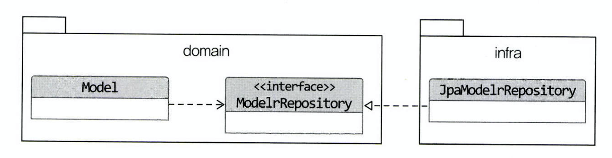
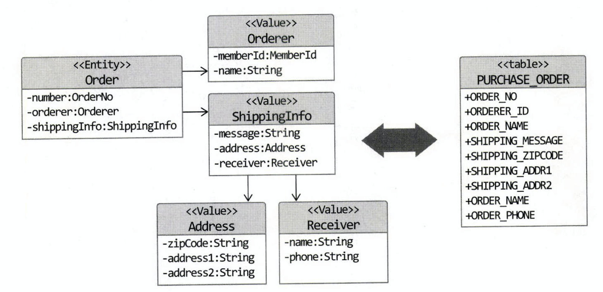

# 4장 리포지터리와 모델구현

# JPA를 이용한 리포지터리 구현

## 모듈 위치



- 리포지터리 인터페이스는 애그리거트와 같이 도메인 영역에 속한다.
- 리포지터리를 구현한 클래스는 인프라스트럭처 영역에 두어야 인프라스트럭처에 대한 의존을 낮출 수 있다.

## 리포지터리 기본 기능 구현

- ID로 애그리거트 조회하기
- 애그리거트 저장하기

```java
public interface OrderRepository {
	public Optional<Order> findById(final OrderNumber orderNumber);
	public void save(final Order order);
}
```

- 인터페이스는 애그리거트 루트를 기준으로 생성한다.
- type safe하게 사용하기 위해서는 반환값으로 null 대신 optional을 사용하는 것이 좋다.
- 구현 클래스에서는 JPA의 EntityManager를 이용하여 엔티티를 저장한다.
- JPA를 사용하면 트랜잭션 범위 내에서 변경된 데이터를 자동으로 DB에 반영하기 때문에 수정사항을 반영하는 메서드를 따로 둘 필요가 없다.
- 애그리거트를 ID외의 다른 조건으로 조회하기 위해서 JPA Criteria 또는 JPQL을 이용할 수 있다.
- 삭제 기능은 원복 등의 이유로 실제로 DB에서 삭제하지 않는 경우가 있으므로 soft delete 적용을 고려하려 구현한다.

# 매핑 구현

## 엔티티와 밸류 기본 매핑 구현



- 애그리거트 루트는 엔티티이므로 `@Entity`로 매핑 설정한다.
- 한 테이블에 엔티티와 밸류 데이터가 같이 있다면
    - 밸류는 `@Embeddable`로 매핑 설정한다.
    - 밸류 타입 프로퍼티는 `@Embedded`로 매핑 설정한다.
    - 밸류 타입에 지정된 컬럼명과 다른 이름을 지정하기 위해 `@AttributeOverrides`어노테이션을 사용할 수 있다.

    ```java
    @Embedded()
        @AttributeOverrides(
                @AttributeOverride(name="zipCode", column=@Column(name = "shipping_zipcode"))
                @AttributeOverride(name="address1", column=@Column(name = "shipping_addr1"))
                @AttributeOverride(name="address2", column=@Column(name = "shipping_addr2"))
        )
        private Address address;
    ```

## 기본 생성자

- 불변의 밸류 타입인 경우 생성 시점에 모든 값을 전달받으므로 setter와 파라미터가 없는 기본 생성자가 불필요하다.
- 그러나 JPA의 `@Entity`와 `@Embeddable`로 클래스를 매핑하려면 기술적인 제약으로 인해 기본 생성자를 제공해야 한다. [참고 링크](https://docs.jboss.org/hibernate/orm/5.2/userguide/html_single/Hibernate_User_Guide.html#entity-pojo-constructor)

> The entity class should have a no-argument constructor. Both Hibernate and JPA require this.

JPA requires that this constructor be defined as public or protected. Hibernate, for the most part, does not care about the constructor visibility, as long as the system SecurityManager allows overriding the visibility setting. That said, the constructor should be defined with at least package visibility if you wish to leverage runtime proxy generation.

- 기본 생성자에 protected 접근 제한자를 부여하면 다른 곳에서 사용하지 못해 오용을 방지할 수 있다.
- 기본 생성자를 만들지 않으면 다음과 같은 에러가 발생한다.

    ```java
    No default constructor for entity:  : com.example.practice.member.domain.Email; nested exception is org.hibernate.InstantiationException: No default constructor for entity:  : com.example.practice.member.domain.Email
    ```

## 필드 접근 방식 사용

- 필드 접근방식 / 프로퍼티 접근 방식 두가지로 매핑 처리를 할 수 있다.
- 프로퍼티 접근방식을 이용하려면 getter/setter를 구현해야 한다.
- 프로퍼티 접근방식을 이용하면 도메인을 단순 자료구조로만 이용할 수 있으므로 되도록이면 필드 접근방식을 사용하는 것이 좋다.
- 필드 접근방식을 이용하면 의미를 부여하여 네이밍 할 수 있다.
    - e.g. 배송지 변경 `setShippingInfo()` → `changeShippingInfo()`
- 밸류 타입은 불변으로 사용하는 경우 setter가 필요없으므로 필드 변경 메서드를 제공하지 않아도 된다.
- JPA 대표 구현체인 하이버네이트는 `@Access`를 통해 명시적으로 접근 방법을 지정하지 않으면 암시적으로 `@Id` 또는 `@EmbeddedId`가 위치한 곳(필드 or 메서드)에 따라 접근 방식을 결정한다.

## AttributeConverter를 이용한 밸류 매핑 처리

- 밸류 타입 내 여러 프로퍼티를 하나의 컬럼에 매핑할 수 있다.
- `AttributeConverter`는 JPA 2.1부터 사용할 수 있다.

```java
package javax.persistence;

public interface AttributeConverter<X, Y> {
	public Y convertToDatabaseColumn(X attribute);
	public X convertToEntityAttribute(Y dbData);
}
```

- e.g. Money

```java
package shop.infra;

import shop.common.Money;
import javax.persistence.AttributeConverter;
import javax.persistence.Converter;

@Converter(autoApply=true)
public class MoneyConverter implements AttributeConverter<Money, Integer> {
	@Override
	public Integer convertToDatabaseColumn(Money money) {
		if (money == null) {
			return null;
		}
		return money.getValue();
	}

	@Override
	public Money convertToEntityAttribute(Integer value) {
		if (value == null) {
			return null;
		}
		return new Money(value);
	}
}
```

- 컨버터 설정시 `autoApply=true`로 두면 모델에 출현하는 모든 Money 프로퍼티에 자동으로 AttributeConverter를 적용한다.

    ```java
    ...
    	@Column(name="total_amounts")
    	private Money totalAmounts;
    ...
    ```

- `autoApply=false`인 경우 프로퍼티에 `@Convert(converter=MoneyConverter.class)`형태로 지정해 줘야 한다.

    ```java
    import javax.persistence.Convert;

    ...
    	@Column(name="total_amounts")
    	@Convert(converter=MoneyConverter.class)
    	private Money totalAmounts;
    ...
    ```

## 밸류 컬렉션: 별도 테이블 매핑

- 밸류 타입의 컬렉션은 별도 테이블에 저장된다.
- 밸류 컬렉션을 별도 테이블에 매핑할 때는 `@ElementCollection`과 `@CollectionTable`을 함께 사용한다.
    - @CollectionTable 생략가능

```java
import javax.persistence.*;

@Entity
@Table(name="purchase_order")
public class Order {
	...
	@ElementCollection
	@CollectionTable(
		name="order_line",
		joinColumns=@JoinColumn(name="order_number")
	)
	@OrderColumn(name="line_idx")
	private List<OrderLine> orderLines;
	...
}
```

```java
@Embeddable
public class OrderLine {
	@Embedded
	private ProductId productId;

	@Column(name="price")
	private Money price;

	@Column(name="quantity")
	private int quantity;
	...
}
```

- OrderLine에는 List의 인덱스 값을 저장하기 위한 프로퍼티가 없으므로 `@OrderColumn`을 통해 지정한 컬럼에 리스트의 인덱스 값을 저장한다.
- 외부키가 여러개인 경우 `@JoinColumn`의 배열을 이용하여 외부키 목록을 지정한다.

## 밸류 컬렉션: 한 개 컬럼 매핑

- e.g. 이메일 주소 목록을 도메인 모델에서는 Set으로 저장하고, DB에서는 한 개 컬럼에 콤마로 구분하여 저장해야 하는 경우 (Set<Email> emails ↔ String dbData)
- `@AttributeConverter`를 이용하면 된다. 단, 밸류 컬렉션을 표현하기 위한 밸류 타입을 추가해야 한다.

## 밸류를 이용한 아이디 매핑

- `String` 또는 `Long` 타입을 이용하여 식별자를 매핑한다.
- 식별자의 의미를 부각하기 위해 밸류 타입으로 만들 수 있다.
- 식별자가 밸류 타입인 경우 `@EmbeddedId`를 이용한다.
- JPA에서 식별자 타입은 Serializable 타입이어야 하므로 식별자로 사용될 밸류 타입은 Serializable 인터페이스를 상속받아야 한다.
- id에 특수한 기능이 필요하다면 유용하다.
    - e.g. 1세대 주문번호와 2세대 주문번호를 구분해야 하는 경우 밸류 타입으로 선언하여 식별 메서드를 구현한다.

    ```java
    if (order.getNumber().is2ndGeneration()) {
    	...
    }
    ```

- JPA에서 엔티티 비교시 `equals`와 `hashCode`를 이용하므로 해당 메서드가 ID 밸류 타입에 구현되어 있어야 한다.

## 별도 테이블에 저장하는 밸류 매핑

- 밸류 매핑을 하기에 앞서 밸류인지 엔티티인지 구분해야 한다.
- 애그리거트에 포함되는 구성요소 중 별도 테이블에 매핑되지만 엔티티가 아닌 것들은 밸류 타입이다.
- 한 애그리거트 안에서 엔티티가 두 개 이상 생긴다면 별도의 애그리거트인지 확인해봐야 한다.
    - 독자적인 라이프사이클을 가지는 경우 별도의 애그리거트일 가능성이 높다.
    - e.g. 상품 조회시 상품에 작성된 리뷰도 함께 보여주지만 이는 별도의 라이프사이클에 생성되며, 서로 영향을 주지 않으므로 "리뷰", "상품"이 각각 별도의 애그리거트로 나뉜다.
- 밸류/엔티티를 구분하는 방법은 고유 식별자를 가지는지 여부를 확인하는 것이다.
    - PK가 있다고 고유 식별자가 있는게 아니다. PK만 보고 OneToOne 관계로 설정하면 안된다.
    - 매핑되는 테이블의 식별자 ≠ 애그리거트의 구성요소의 식별자
    - e.g. 게시물과 게시물 본문을 나누어 저장한다고 할 때, 게시물 본문은 게시물의 내용을 담은 밸류이다. 그러므로 OneToOne 관계가 아닌 밸류 매핑을 해줘야 한다.

```java
import javax.persistence.*;

@Entity
@Table(name="article")
@SecondaryTable(
	name="article_content",
	pkJoinColumns=@PrimaryKeyJoinColumn(name="id")
)
public class Article {
	@Id
	private Long id;
	private String title;
	...
	@AttributeOverrides({
		@AttributeOverride(name="content", column=@Column(table="article_content")),
		@AttributeOverride(name="contentType", column=@Column(table="article_content")),
	})
	private ArticleContent content;
}
```

- @SecondaryTable
    - name: 밸류를 저장할 테이블 지정
    - pkJoinColumns: 밸류 테이블에서 엔티티 테이블로 조인할 때 사용할 컬럼 지정
- 위 방식으로 매핑하면 매번 article_content를 조인해 가져오게 된다.
    - 원하던 방식이 아니라면 OneToOne으로 엔티티 매핑하고 지연로딩 할 수 있지만 밸류를 엔티티로 만드는 것이므로 지양해야 한다.
    - 조회 방식을 변경하려면 조회 전용 기능을 구현하는 편이 낫다.

## 밸류 컬렉션을 @Entity로 매핑하기

- 구현 기술의 한계나 팀 표준인 경우 사용한다.
- e.g. 제품의 이미지 업로드 방식에 따라 이미지 경로와 썸네일 이미지 제공 여부가 달라지는 경우

    → 상속 구조로 구성할 수 있는데, JPA는 `@Embeddable`타입 클래스에 상속 매핑을 지원하지 않는다.

    → 밸류 타입 대신에 `@Entity`를 이용한 상속 매핑 처리를 해야 한다.

### Entity 상속 매핑

- 상속 매핑을 이용하기 위해서는 구현 클래스를 구분하기 위한 타입 식별 (discriminator)컬럼을 추가해야 한다.
- `@Inheritance(strategory = InheritanceType.SINGLE_TABLE)`
    - 단일 테이블 전략
    - 하나의 테이블을 상속 가능한 테이블로 지정하여 여러 구현체가 공유하도록 설정한다.
    - JPA에서 별도의 값을 지정하지 않으면 기본값이다.
- `@DiscriminatorColumn`
    - 상속한 테이블을 식별하기 위한 컬럼을 지정한다.
- `@DiscriminatorValue`
    - 상속받은 구현 테이블에서 식별자를 지정하는 방법이다.
- 관계 매핑시 `cascade` 옵션을 이용하여 애그리거트 생성시 같이 생성되고 소멸시 같이 제거되도록 만들어 라이프사이클을 동일하게 설정할 수 있다.
    - `@Entity`로 매핑한 컬렉션은 `clear()`메서드 호출시 조회쿼리 + 각 엔티티 삭제 쿼리 = N+1쿼리가 나간다.
    - `@Embeddable` 타입 컬렉션에서 `clear()`메서드를 사용하면 삭제 쿼리 한번만 나간다.
    - 위 경우에 성능을 위해 다형성을 포기하고 `@Embeddable`컬렉션으로 만드는 편이 나을 수 있다. 단, 이미지 업로드 방식별로 조건분기 처리를 해야한다. (코드 유지보수성 VS 성능 trade-off)

        → 전략패턴 쓰면 안되는가...?

- 예제 참고: 130p
- 참고 자료: [https://www.baeldung.com/hibernate-inheritance](https://www.baeldung.com/hibernate-inheritance)

## ID 참조와 조인 테이블을 이용한 단방향 M:N 매핑

- 애그리거트간 집합 연관은 성능상의 이유로 되도록이면 피하는 편이 낫다.
- 요구사항 구현시 집합 연관을 사용하는게 유리하다면 ID 참조를 통해 단방향 집합 연관을 적용할 수 있다.
- 밸류와 연관을 맺는 것이 아니라, 식별자와 연관을 맺는 것이다.
- `@ElementCollection`을 이용하기 때문에 애그리거트 삭제시 매핑할 때 사용한 조인 테이블의 데이터도 함께 삭제된다.
- ID 참조이므로 영속성 전파, 로딩 전략 등을 생각할 필요가 없다.
- 예제 참고: 134p

# 애그리거트 로딩 전략

- 애그리거트에 속한 모든 객체가 로딩되어야 완전한 하나가 된다.
- 즉시 로딩(`FetchType.EAGER`)으로 설정하면 모든 연관매핑 구성요소를 한꺼번에 가져온다.
- 컬렉션에 항상 즉시 로딩을 사용하면 카타시안 조인을 사용하여 애그리거트에 여러 컬렉션 컬럼이 있는 경우 쿼리 성능이 나빠질 수 있다. (예제 참고: 136p)
- 상태를 변경할 때 애그리거트의 상태는 완전해야 한다.
    - 트랜잭션 범위 내에서 지연 로딩을 지원하므로 반드시 즉시 로딩을 할 필요는 없다.
    - 일반적인 어플리케이션에서 상태변경보다는 조회 호출의 빈도가 크다는 점을 고려하면 지연로딩으로 인한 성능 지연은 큰 문제가 되지 않는다.
- 표현 영역에서 애그리거트의 상태 정보를 보여줄 때 필요하다.
    - OSIV라는 녀석도 있긴 하지만... 조회를 위한 목적으로 사용하지 않는 편이 좋을듯 하다.
    - 조회 전용 기능을 이용하면 큰 문제가 되지 않는다.
- 모든 케이스가 동일할 수는 없다. 상황에 맞게 고민 후 즉시로딩 / 지연로딩 전략을 결정하자.

# 애그리거트의 영속성 전파

- 애그리거트를 조회할 때 뿐만 아니라 저장, 삭제할 때도 하나로 처리해야 한다.
    - 저장시 애그리거트 내 모든 객체를 저장해야 한다.
    - 삭제시 애그리거트에 속한 모든 객체를 삭제해야 한다.
- `@Embeddable`은 함께 저장되고 삭제되므로 cascade 속성을 추가 설정하지 않아도 된다.
- `@Entity` 매핑은 cascade 속성을 사용하여 저장과 삭제시 함께 처리되도록 설정해야 한다.

# 식별자 생성 기능

- 크게 세 가지 방법으로 생성할 수 있다.
    - 사용자가 직접 생성
        - e.g. 이메일
    - 도메인 로직으로 생성
        - 도메인 규칙이므로 도메인 영역에 생성 규칙이 위치해야한다.
            - e.g. 도메인 서비스
            - e.g. 리포지터리 인터페이스에 생성 메서드를 추가하고 구현 클래스에서 구현체 제공
        - e.g. 주문 번호를 고객 ID와 타임스탬프로 생성한다.
    - DB를 이용한 일련번호 사용
        - 자동 증가: `@GeneratedValue(strategy = GenerationType.IDENTITY)`
        - 도메인 객체를 생성하는 시점에는 식별자를 알 수 없고, 저장한 뒤에 알 수 있다.