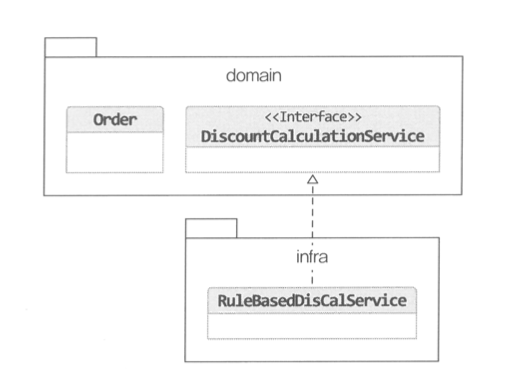

# 7장 도메인 서비스

# 여러 애그리거트가 필요한 기능

**e.g. 결제 금액 계산 로직**

- 상품 애그리거트: 상품 가격과 상품에 따른 배송비 계산
- 주문 애그리거트: 상품별 구매 개수
- 할인 쿠폰 애그리거트: 쿠폰별로 지정한 할인 금액이나 비율에 따라 주문 총 금액을 할인. 할인 쿠폰 조건에 따른 할인가격 계산
- 회원 애그리거트: 회원 등급에 따른 추가할인
- 한 애그리거트에 넣기 애매한 도메인 기능을 특정 애그리거트에서 억지로 구현하면 안된다.
- 하나의 애그리거트에서 책임 범위를 벗어나는 기능을 구현하려고 하면 코드가 길어지고, 외부 의존성이 높아지는 문제점이 있다.

# 도메인 서비스

- 한 애그리거트에 넣기 애매한 도메인 개념을 구현하기 위해 도메인 로직을 다루는 도메인 서비스를 구현할 수 있다.
- 도메인 서비스는 도메인 영역 내의 애그리거트, 밸류와는 다르게 상태 없이 로직만 구현한다.
- 도메인 서비스를 구현하는데 필요한 상태는 애그리거트나 다른 방법으로 전달받는다.
- 도메인 서비스를 사용하는 주체는 애그리거트가 될 수도 있고, 응용 서비스가 될 수도 있다.
- 애그리거트가 도메인 서비스를 사용할 때에는 도메인 서비스가 모델의 구성요소가 아니기 때문에 DI를 통해 주입하지 않고 메서드 파라미터로 넘기는 편이 적절하다.
- 도메인 서비스는 응용 로직을 수행하지는 않는다. 즉, 트랜잭션 처리와 같은 로직은 응용 로직이므로 응용 서비스에서 처리한다.

**e.g. 결제 금액 계산 로직: 애그리거트에 도메인 서비스 전달하기**

```java
public class DiscountCalculationService {
	public Money calculateDiscountAmounts(
			List<OrderLine> orderLines,
			List<Coupon> coupons,
			MemberGrade grade) {
		Money couponDiscount = coupons.stream()
				.map(coupon -> calculateDiscount(coupon))
				.reduce(Money(0), (v1, v2) -> v1.add(v2))

		Money membershipDiscount = calculateDiscount(orderer.getMember().getGrade());

		return couponDiscount.add(membershipDiscount);
	}

	private Money calculateDiscount(Coupon coupon) {
		...
	}

	private Money calculateDiscount(MemberGrade grade) {
		...
	}
}

public class Order {
	public void calculateAmounts(
			DiscountCalculationService discountCalculationService,
			MemberGrade grade) {
		Money totalAmounts = getTotalAmounts();
		Money discountAmounts = discountCalculationService.calculateDiscountAmounts(this.orderLines, this.coupons, grade);
		this.paymentAmounts = totalAmounts.minus(discountAmounts);
	}
}
```

**e.g. 계좌 이체 기능: 응용 서비스에서 도메인 서비스 사용하기**

```java
public class TransferService {
	public void transfer(Account fromAccount, Account toAccount, Money amounts) {
		fromAccount.withdraw(amounts);
		toAccount.credit(amounts);
	}
}
```

## 도메인 서비스 / 응용 서비스 판별하기

- 해당 로직이 애그리거트의 상태를 변경하거나 애그리거트의 상태 값을 계산하는지 여부를 검사한다.
    - 계좌 이체: 계좌 애그리거트의 상태를 변경
    - 결제 금액 계산: 주문 애그리거트의 주문 금액을 계산

    → 애그리거트의 상태를 변경하고, 애그리거트의 값을 계산하는 도메인 로직이다.

    → 도메인 로직이면서 한 애그리거트에 넣기 애매하므로 두 로직은 도메인 서비스로 구현한다.

## 도메인 서비스의 패키지 위치


- 다른 도메인과 동일하게 도메인 패키지에 위치시킨다.
- 도메인 서비스의 개수가 많거나 엔티티나 밸류와 같은 다른 구성요소와 명시적으로 구분하고 싶다면 domain 패키지 밑에 `domain.model`, `domain.service`, `domain.repository`와 같이 하위 패키지를 구분해서 위치시켜도 된다.

## 도메인 서비스의 인터페이스와 클래스

- 도메인 서비스의 로직이 고정되어 있지 않은 경우 도메인 서비스 자체를 인터페이스로 구현하고 이를 구현한 클래스를 둘 수 있다.



- 외부 시스템이나 별도 엔진을 이용하여 도메인 로직을 구현하는 경우에는 구현 용이성을 제거하고 테스트 용이성을 확보하기 위해 인터페이스로 철저히 분리해 주는 것이 좋다.
    - 이 때, 인터페이스는 도메인 패키지에 위치시키고, 구현은 인프라스트럭처 영역에 위치시킬 수 있다.
