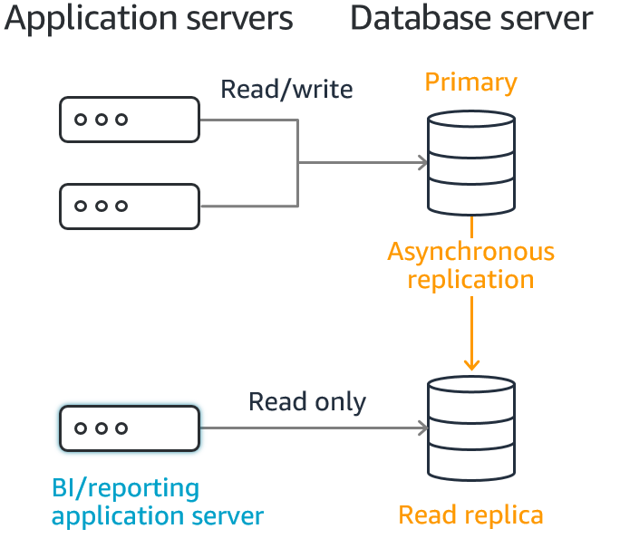

# 1장 MySQL과  MariaDB 개요

## 상용 RDBMS와의 차이점

### 구조적 차이

- 고가용성을 위한 이중화 구조 구축시 오라클 DB는 통합된 스토리지 하나를 공유하여 사용한다.
- MySQL은 물리적인 DB 서버마다 독립적으로 스토리지를 할당하여 구성한다.

- MySQL은 이중화를 위한 cluster 또는 replication 구성으로 운영시 보통은 **master-slave(primary-secondary) 구조**가 대부분이다.
- master-slave 방식으로 이중화시 master 노드는 쓰기/읽기를 모두 처리 가능하나, slave 노드는 읽기만 할 수 있다.
- master-slave 구조로 이중화 구성시 쓰기는 master, 읽기는 slave에서 처리하도록 구성할 수 있다.
- 쿼리 오프로딩: DB 서버의 트랜잭션에서 쓰기 트랜잭션과 읽기 트랜잭션을 분리하여 DB 처리량을 증가시키는 성능 향상 기법
    - 쓰기 트랜잭션: UPDATE, INSERT, DELETE
    - 읽기 트랜잭션: SELECT
- DB 서버마다 스펙(e.g. 스토리지의 크기, 시스템 변수, 하드웨어 사양 등)이 다를 수 있으므로 쿼리 튜닝시 이를 이해하고 처리해야 한다.

### 지원 기능 차이

- MySQL은 대부분 `중첩 루프 조인(nested loop join)` 방식으로 조인을 수행한다.
- 오라클, PostgreSQL에서는 중첩 루프 조인뿐만 아니라 `정렬 병합 조인(sort merge join)`, `해시 조인 (hash join)` 방식도 지원한다.
    - 최근 MySQL에서도 제약적으로 해시 조인을 제공하지만, 여전히 주로 중첩 루프 조인을 사용한다.
- MySQL은 오라클과 달리 데이터를 저장하는 **스토리지 엔진**이라는 개념을 포함한다.
- MySQL은 오라클 대비 메모리 사용률이 상대적으로 낮으므로 저사양 컴퓨팅 환경에 설치 가능하다.

### SQL 구문 (오라클 문법은 편의상 생략)

- `IFNULL(컬럼명, '대체값')`: 해당 컬럼이 null인 경우 값을 대체
- `LIMIT 숫자`: 페이징
- `NOW()`: 현재 날짜
    - 트랜잭션이 시작하는 시점에 결정되어 트랜잭션이 끝날 때까지 동일한 값을 사용한다.
    - MySQL에서는 데이터베이스의 timezone 설정에 따라 시간을 표기한다. 즉, 데이터베이스 구성시 timezone을 설정해두면 클라이언트의 설정과 무관하게 시간 관련 함수를 사용할 수 있다.
    - PostgreSQL에서는 timezone을 포함한 컬럼 저장시 UTC로 시간 데이터를 저장하며, 클라이언트의 timezone 설정에 따라 시간을 표기한다. 즉, 클라이언트마다 timezone을 설정해 두어야 한다.
- `IF(조건식, '참값', '거짓값')`: 조건문
- `CASE ~ WHEN ~ THEN ~ ELSE END`: 다중 조건문
- `DATE_FORMAT(날짜열, '형식')`: 날짜를 지정한 포맷으로 변경
    - e.g. `DATE_FORMAT(NOW(), '%Y%m%d %H%i%s')`
- 자동 증갓값: 새로운 순번을 DB에서 채번한다.
    - 순번을 매길 컬럼에 `AUTO_INCREMENT`를 설정하여 테이블 내 하나의 열에 자동으로 증가하는 숫자를 저장할 수 있다.
    - `sequence`라는 오브젝트를 생성하여 순번을 매기는 기능을 활용할 수 있다. `CREATE SEQUENCE`문으로 생성하고, `SELECT NEXTVAL(시퀀스명)`구문으로 신규 순번을 매긴다.
- `CONCAT(문자열, 문자열)`: 두 문자열을 이어붙인다.
- `SUBSTRING(문자열, 시작 위치 (1부터 시작), 추출하려는 문자 수)`: 문자열에서 부분 문자열을 추출한다.

## MySQL과 MariaDB 튜닝의 중요성

- 기능적인 제약사항이 있으므로 DBMS 제공 기능을 더 자세히 알아야 한다.
    - 대다수의 SQL문이 중첩 루프 조인 알고리즘으로 수행된다.
    - 상용 DBMS와 다르게 수행된 쿼리 결과가 메모리에 적재되는 캐시 기능에 한계가 있다.
- 실행 계획을 해석하여 문제점을 식별 및 대응할 수 있는 능력을 갖춘 뒤 쿼리 튜닝을 진행할 수 있어야 한다.