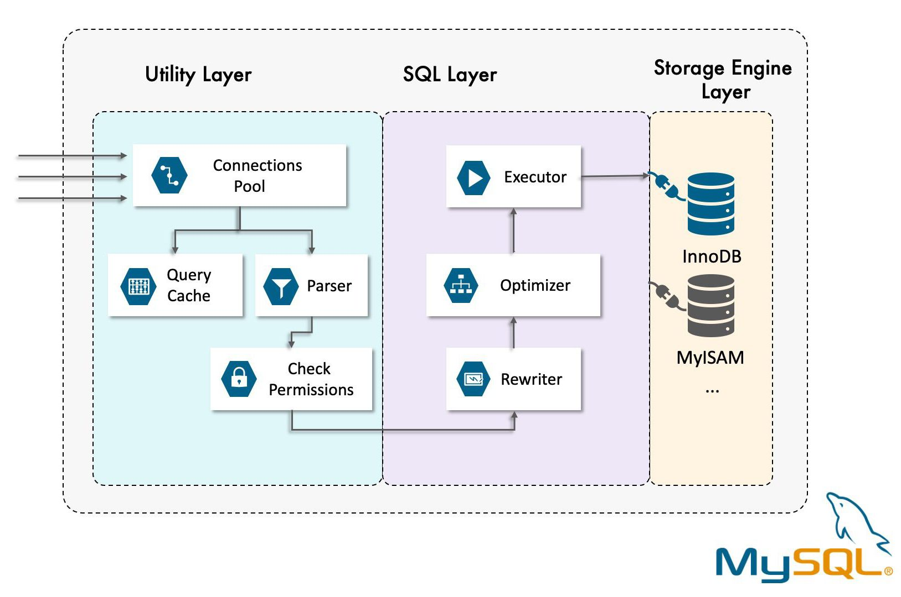

# 2장 SQL 튜닝 용어를 직관적으로 이해하기

## 물리 엔진과 오브젝트 용어

### DB 엔진 용어


**SQL 요청 처리 흐름**

→ 사용자가 SQL을 실행한다.

→ 실행된 SQL문은 **파서**를 통해 MySQL 엔진에서 문법 에러가 있는지, 존재하는 테이블 대상으로 쿼리를 작성했는지 등을 확인한다.

→ **옵티마이저**를 통해 사용자가 요청한 데이터를 빠르고 효율적으로 찾아가는 전략적 **실행 계획**을 수립한다.

→ 실행 계획을 토대로 **스토리지 엔진**에 위치한 데이터까지 찾아간 뒤 해당 데이터를 MySQL 엔진으로 전달한다.

→ **MySQL 엔진**은 전달된 데이터에서 불필요한 부분을 필터링(제거, 변경)하고 필요한 연산을 수행한다.

→ 사용자에게 최종 결과를 알려준다.

**스토리지 엔진**

- e.g. InnoDB, MyISAM, Memory
- 사용자가 요청한 SQL문을 토대로 DB에 저장된 디스크나 메모리에서 필요한 데이터를 가져와 MySQL 엔진으로 보낸다.
- 사용하고자 하는 스토리지 엔진을 설치하여 사용할 수 있다.
- InnoDB
    - 기본 스토리지 엔진이다.
    - 다양한 기능을 가지고 있어 시스템 자원을 많이 사용한다.
    - 일반적인 환경(OLTP 환경)에서 주로 사용한다.
    - MVCC 기술을 이용해 락을 걸지 않고 읽기 작업을 수행하여 성능상 이점이 있다.
    - 장애 복구 기능을 가지고 있어 무결성이 중요한 데이터를 다룰 때 용이하다.
    - 트랜잭션이 제공된다. (ACID)
    - ROW 단위로 락을 걸 수 있다.
- MyISAM
    - 별다른 기능이 없어 속도가 빠르다.
    - 대량의 쓰기 트랜잭션이 발생하는 환경에 적합하다.
    - 트랜잭션이 제공되지 않아 속도가 빠르나 동시성 제어가 어렵다.
    - 테이블 단위로만 락을 걸 수 있다.
- Memory
    - 메모리에 데이터를 저장하는 엔진이다.
    - 메모리 데이터 로드를 빠르게 읽는 효과를 낼 수 있다.
    - 데이터가 유실될 위험이 있어 중요하지 않지만 빠른 처리가 필요한 임시 테이블로 사용한다.

 

**MySQL 엔진**

- 사용자가 요청한 SQL문을 넘겨받은 뒤 SQL 문법 검사와 적절한 오브젝트 활용 검사를 한다.
- SQL문을 최소 단위로 분리하여 원하는 데이터를 빠르게 찾는 경로를 모색하는 역할을 수행한다.
- 스토리지 엔진으로부터 전달받은 데이터 대상으로 불필요한 데이터를 제거/가공/연산한다.

### SQL 프로세스 용어



**파서**

- MySQL 엔진에 포함되는 오브젝트다.
- 사용자가 요청한 SQL문을 쪼개 최소 단위로 분리하고 트리를 만든다.
- 트리를 만들면서 문법 검사를 수행한다.
- e.g. parse tree 생성

    ```sql
    SELECT title FROM StartsIn, MovieStar WHERE starName=”Jack” AND birthday like “%1960”
    ```

    


**전처리기**

- MySQL 엔진에 해당하는 오브젝트다.
- 파서에서 생성한 트리를 토대로 SQL문에 구조적인 문제가 없는지 파악한다.
- SQL문에 작성된 테이블, 열, 함수, 뷰와 같은 오브젝트가 실질적으로 이미 생성된 오브젝트인지 확인한다.
- 접근 권한이 부여되어 있는지 확인한다.

**옵티마이저**

- MySQL의 핵심 엔진 중 하나다.
- 전달된 파서 트리를 토대로 필요하지 않은 조건은 제거하거나 연산 과정을 단순화한다.
- 실행 계획을 수립한다.
    - 어떤 순서로 테이블에 접근할지
    - 인덱스를 사용할지, 사용한다면 어떤 인덱스를 사용할지
    - 정렬할 때 인덱스를 사용할지, 사용한다면 임시 테이블을 사용할지
- 실행 계획으로 도출할 수 있는 경우의 수가 지나치게 많을 때는 최적의 실행 계획을 선택하기까지 오래 걸리므로 모든 실행 계획을 판단하지는 않는다.
- 옵티마이저가 선택한 최적의 실행 계획이 최상의 실행 계획이 아닐 가능성도 있다.

**엔진 실행기**

- MySQL 엔진과 스토리지 엔진 영역 모두에 걸치는 오브젝트다.
- 옵티마이저에서 수립한 실행 계획을 참고하여 스토리지 엔진에서 데이터를 가져온다.
- 이후 MySQL 엔진에서 읽어온 데이터를 정렬, 조인, 필터링한다.
- MySQL 엔진 부하를 줄이기 위해서는 스토리지 엔진에서 가져오는 데이터 양을 줄이는게 중요하다.

### DB 오브젝트 용어

- 오브젝트: 데이터베이스를 구성하는 요소

**테이블**

- 데이터를 저장하는 오브젝트다.
- 행과 열 정보를 담는다.
- MySQL은 2차원 배열 형태로 테이블을 관리한다.

**로우**

- 동일한 구조의 데이터 항목들의 집합이다.
- 로우 수가 많아지면 데이터 접근 시간이 오래 걸릴 수 있으며, 파티셔닝을 통해 SQL 성능 향상을 검토해볼 수 있다.

**컬럼**

- 사전에 정의한 데이터 유형으로 데이터 값을 저장한다.
- 컬럼별로 다른 데이터 유형을 가질 수 있다.

**기본 키**

- 어떤 행과도 중복되지 않는 대표값이다.
- 상황에 따라 2개 이상의 열을 조합해 기본 키를 구성할 수 있다.
- 기본 키는 인덱스 역할도 수행하므로 기본 키를 활용하여 인덱싱 할 수 있다.
- MySQL에서 기본 키는 클러스터형 인덱스로 작동한다.
- 열 순서를 기준으로 물리적인 스토리지에 순서대로 쌓인다.
- 비슷한 기본 키 값들이 근거리에 적재되어 접근 속도가 더 빠르다. (시퀀셜 엑세스)

**외래 키**

- 외부 테이블을 항상 참조하면서 외부 테이블의 데이터가 변경되면 함께 영향을 받는 관계를 설정하는 키
- 외부 테이블은 부모 테이블, 외부 테이블을 참조하는 테이블을 자식 테이블이라고 생각하면 된다.

**인덱스**


- 데이터베이스에서 키값으로 실제 데이터 위치를 식별하고 데이터 접근 속도를 높이고자 생성되는 키 기준으로 정렬된 오브젝트이다.
- 테이블 전체를 조회하는 비효율적인 방식을 개선하고자 만든다.
- 인덱스를 생성하려는 컬럼 속성에 따라 unique 인덱스와 non-unique 인덱스로 구분된다.
    - **고유 인덱스**
        - 인덱스를 구성하는 열들의 데이터가 유일하다는 의미다.
        - 로우 생성시 컬럼 중복 여부를 체크하여 중복된다면 에러가 발생한다.
        - 기본 키와 달리 NULL 허용시 NULL을 입력할 수 있다.
    - **비고유 인덱스**
        - 일반적으로 인덱스를 언급하면 비고유 인덱스이다.
        - 인덱스를 구성하는 열들의 데이터가 유일하지 않다는 의미다.
        - 고유 인덱스와 달리 중복 체크를 하지 않는다.

**뷰**


- 가상 테이블이다.
- 실체는 없지만 간접적으로 대상을 확인할 수 있는 스트리밍 방식이다.
- 노출에 민감한 데이터 조회에 제약을 설정할 수 있다.
- 여러개의 테이블을 JOIN하여 활용할 때 성능을 고려하여 최적화된 뷰를 생성해두면 매번 JOIN 할 때마다 고민하지 않고 뷰를 사용함으로써 일관된 성능을 제공할 수 있다.

## 논리적인 SQL 개념 용어

### 서브쿼리 위치에 따른 SQL 용어

- 서브쿼리
    - 쿼리 안의 보조쿼리이다.
    - 메인 쿼리를 기준으로 내부에 SELECT문을 추가로 작성하여 서브쿼리를 만든다.
    - 작성된 위치에 따라 부르는 용어가 다르다.
    - 작성되는 곳은 크게 SELECT절, FROM절, WHERE절로 나뉜다.

**스칼라 서브쿼리**

- SELECT절에 있는 서브쿼리이다.
- 서브쿼리 결과가 ROW당 하나여야 한다.
- 주로 집계함수(COUNT, MIN, MAX, AVG, SUM)가 자주 쓰인다.

**인라인 뷰**

- FROM절에 있는 서브쿼리이다.
- FROM절 내부에서 일시적으로 뷰를 생성하는 방식이다.
- 인라인 뷰의 결과는 내부적으로 메모리 또는 디스크에 임시 테이블을 생성하여 활용한다.

**중첩 서브쿼리**

- WHERE절에 있는 서브쿼리이다.
- WHERE절에서 보다 복잡한 값과 비교하기 위해 사용한다.
- 보통 비교 연산자(=, >, <, >=, <=, <>, !=), (NOT) IN, (NOT) EXISTS와 함께 쓰인다.

### 메인쿼리와의 관계성에 따른 SQL 용어

**비상관 서브쿼리**

- 메인 쿼리와 서브쿼리 간에 관계성이 없음을 의미한다.
- 서브쿼리가 독자적으로 실행된 뒤 메인쿼리에 결과를 던저주는 형태이다.
- 비상관 서브쿼리가 먼저 실행된 후, 메인 쿼리가 그 결과를 활용한다.
- DB 버전 및 옵티마이저에 따라 서브쿼리가 제거되고 하나의 메인쿼리로 통합되는 뷰 병합(SQL 재작성)이 작동할 수 있다.

**상관 서브쿼리**

- 메인 쿼리와 서브쿼리 간에 관계성이 있음을 의미한다.
- 서브쿼리가 수행되기 위해서 메인쿼리의 값을 받아야 하므로 서로 연관관계를 가지고 있다.
- 스칼라 서브쿼리와 중첩 서브쿼리에서 발생한다.
- 메인쿼리 실행 → 서브쿼리 실행 → 메인쿼리 실행의 순서를 갖는다.
- DB 버전 및 옵티마이저에 따라 서브쿼리가 제거되고 하나의 메인쿼리로 통합되는 뷰 병합(SQL 재작성)이 작동할 수 있다.

### 반환 결과에 따른 SQL 용어

- 서브쿼리 결과 갯수에 따라 용어가 나뉜다.

**단일ROW 서브쿼리**

- 서브쿼리 결과가 row 1건으로 반환된다.
- SELECT절에서 사용하는 스칼라 서브쿼리와 동일하다고 볼 수 있다.
- 단일row 서브쿼리는 메인쿼리보다 먼저 호출된다.

**다중ROW 서브쿼리**

- 서브쿼리 결과가 여러 건의 row로 반환된다.
- 메인쿼리의 조건절에서는 IN 구문으로 서브쿼리에서 반환되는 값들을 받는다.

**다중COLUMN 서브쿼리**

- 서브쿼리 결과가 여러 개의 row와 column으로 반환된다.
- row가 여러개이기 때문에 다중row 서브쿼리와 마찬가지로 IN 구문으로 반환값을 받아야 한다.

### 조인 연산방식 용어

- 전체 외부 조인은 MySQL에서 제공하지 않는다.


**내부 조인**

- 교집합에 해당한다.
- 양쪽에 모두 존재하는 데이터만 반환한다.
- 명시적 조인과 암시적 조인으로 나뉜다.
    - 명시적 조인
        - `SELECT FROM 테이블명 JOIN 조인할 테이블명 ON 조인 조건`
    - 암시적 조인
        - `SELECT FROM 테이블명, 조인할 테이블명 WHERE 조인 조건`

**왼쪽 외부 조인**

- 왼쪽 테이블 기준으로 오른쪽 테이블과 조인을 수행한다.
- 조인 조건과 일치하지 않더라도 왼쪽 테이블 결과는 항상 포함된다.
- 조인 결과가 없으면 오른쪽 테이블 컬럼이 NULL로 출력된다.
- `SELECT FROM 테이블명 LEFT OUTER JOIN 조인할 테이블명 ON 조건`

**오른쪽 외부 조인**

- 오른쪽 테이블 기준으로 왼쪽 테이블과 조인을 수행한다.
- 조인 조건과 일치하지 않더라도 오른쪽 테이블의 결과는 항상 포함된다.
- 조인 결과가 없으면 왼쪽 테이블 컬럼이 NULL로 출력된다.
- `SELECT FROM 테이블명 RIGHT OUTER JOIN 조인할 테이블명 ON 조건`
- 대상 테이블과 순서만 바꾸면 왼쪽 외부 조인과 동일하므로 일관성을 위해 보통 왼쪽 외부 조인만 이용한다.

**교차 조인**

- 데카르트 곱이라고하는 곱집합 개념이다.
- 테이블에서 발생할 수 있는 모든 조합을 찾아내 반환한다.
- 조인 연산과정에서 시간, 공간적 리소스 점유 측면에서 오버헤드가 발생하므로 주의해야 한다.
- 명시적 조인과 암시적 조인으로 나뉜다.
    - 명시적 조인
        - `SELECT FROM 테이블명 CROSS JOIN 조인할 테이블명`
    - 암시적 조인
        - `SELECT FROM 테이블명, 조인할 테이블명`

**자연 조인**

- 2개 테이블에 동일한 컬럼명이 있을 때 조인 조건절을 따로 작성하지 않아도 자동으로 조인을 수행해주는 방식이다.
- 조인이 제대로 성사되면 내부 조인과 동일한 결과가 출력된다.
- 동일한 컬럼이 없는 경우에는 교차 조인으로 결과가 출력된다.
- 의도치 않은 결과를 낼 수 있으므로 일반적으로 잘 사용하지 않는다.
- `SELECT FROM 테이블명 NATURAL JOIN 조인할 테이블명`

LATERAL 조인

- 일반적으로 FROM절에서는 앞서 나온 다른 테이블의 컬럼을 참조할 수 없는데, LATERAL 조인을 이용하면 다른 테이블을 참조할 수 있다.
- FROM절 서브쿼리이므로 인라인 뷰라고 볼 수 있다.
- `SELECT FROM 테이블명 LATERAL (SELECT FROM 조인할 테이블명 ~ WHERE 조건)`

### 조인 알고리즘 용어

- 조인을 수행할 때는 동시 접근이 불가능해 우선순위에 따라 진행된다.
- 테이블에 접근하는 선후단계에 따라 드라이빙 테이블과 드리븐 테이블로 구분된다.

**드라이빙 테이블과 드리븐 테이블**

- 먼저 접근하는 테이블이 드라이빙 테이블이다.
- 나중에 접근하는 테이블이 드리븐 테이블이다.
- e.g. 학생 학번이 1 또는 100에 해당하는 학생의 비상 연락망을 찾는다.

    ```sql
    SELECT 학생.학번, 학생.이름, 비상연락망.관계, 비상연락망.연락처
    FROM 학생
    JOIN 비상연락망
    ON 학생.학번 = 비상연락망.학번
    WHERE 학생.학번 IN (1, 100)
    ```

    - 드라이빙 테이블: 학생
    - 트리븐 테이블: 비상연락망
- 적은 결과가 반환될 것으로 예측되는 드라이빙 테이블을 선정하고, 조인 조건절의 컬럼이 인덱스로 설정되도록 구성해야 한다.

예시: 학생 학번이 1 또는 100에 해당하는 학생의 비상 연락망을 찾는다.

- 조건
    - 학생 테이블: 100 ROW
    - 비상연락망 테이블: 1,000 ROW
    - 학생1의 비상 연락망: 2 ROW
    - 학생100의 비상 연락망: 1 ROW
- 극단적인 경우
    - 학생 1을 찾기 위해 100건의 데이터에 접근한다.
    - 비상연락망 테이블 1,000건에 접근한다.
    - 학생 100을 찾기 위해 100건의 데이터에 접근한다.
    - 비상연락망 테이블 1,000건에 접근한다.
    - 약 2,200건의 데이터에 접근한다.
- 학번에 인덱스가 있고, 비상연락망 테이블에도 학번에 인덱스가 있는 경우
    - 학번 1을 찾는다 → 1건
    - 학번 1의 비상연락망을 찾는다 → 2건
    - 학번 100을 찾는다 → 1건
    - 학번 100의 비상연락망을 찾는다 → 1건
    - 총 6건의 데이터에 접근

**중첩 루프 조인 (NL 조인)**


- 드라이빙 테이블의 데이터 1건당 드리븐 테이블을 반복해 검색한다.
- 최종적으로 양쪽 테이블에 공통된 데이터를 출력한다.
- e.g.
    - 극단적인 경우
        - 학생 1을 찾기 위해 100건의 데이터에 접근한다.
        - 비상연락망 테이블 1,000건에 접근한다.
        - 학생 100을 찾기 위해 100건의 데이터에 접근한다.
        - 비상연락망 테이블 1,000건에 접근한다.
        - 약 2,200건의 데이터에 접근한다.
    - 학번에 인덱스가 있고, 비상연락망 테이블에도 학번에 인덱스가 있는 경우
        - 학번 1을 찾는다 → 1건
        - 학번 1의 비상연락망을 찾는다 → 2건
        - 학번 100을 찾는다 → 1건
        - 학번 100의 비상연락망을 찾는다 → 1건
        - 총 6건의 데이터에 접근
- 인덱스를 이용하여 데이터를 찾으면 랜덤 엑세스가 발생한다.
- 랜덤 엑세스를 줄일 수 있는 방향으로 데이터의 엑세스 범위를 좁히는 방향으로 인덱스를 설계하고 조건절을 작성해야 한다.
- 랜덤 엑세스를 유발하는 인덱스는 기본 키가 아닌 비고유 인덱스일 경우에 해당한다.
    - 기본 키 = 클러스터형 인덱스 = 순차접근

**블록 중첩 루프 조인 (BNL 조인)**


- 중첩 루프 조인의 효율성을 높일 수 있는 조인 방식이다.
- 드라이빙 테이블에 대해 조인 버퍼라는 개념을 도입하여 조인 성능을 향상시킨다.
- 처리 과정
    - 드라이빙 테이블인 학생 테이블에서 학번이 1, 100인 데이터를 검색한다.
    - 검색된 데이터를 조인 버퍼에 가득 채워질 때까지 적재한다.
    - 조인 버퍼와 비상연락망 테이블의 데이터를 비교한다.

    → 비상 연락망 테이블의 테이블 풀 스캔을 방지할 수 있다.

- 조인 버퍼 데이터와 비상연락망 테이블의 한 번의 테이블 풀 스캔으로 모든 데이터를 찾을 수 있다.
- 블록 해시 조인: 블록 중첩 루프 조인 방식과 유사하다. 조인 버퍼에 쌓인 데이터에 해시값을 적용하고, 그 값을 기준으로 조인을 수행한다는 점이 다르다.

**배치 키 엑세스 조인 (BKA 조인)**


- 랜덤 엑세스의 단점을 해결하고자 접근할 데이터를 미리 예상하고 가져오는 데 착안한 조인 알고리즘이다.
- BNL조인의 조인 버퍼 개념을 사용한다.
- 다중 범위 읽기
    - 드리븐 테이블에 필요한 데이터를 미리 예측하고 정렬된 상태로 담는 랜덤 버퍼를 사용하는 것이다.
    - 드리븐 테이블의 내용을 정렬하여 담아두기 때문에 시퀄셜 엑세스를 수행한다.
- 처리 과정
    - 드라이빙 테이블에서 필요한 데이터를 추출하여 조인 버퍼에 적재한다.
    - 드리븐 테이블의 인덱스 기반으로 필요한 데이터를 예측하여 랜덤 버퍼에 적재한다.
    - 조인 조건절로 비교하여 동일한 데이터가 있다고 판단되면 드리븐 테이블의 데이터에 접근하고 결과를 조인하여 반환한다.

**해시 조인**


- MySQL 8.0.18 버전부터 지원한다.
- 조인에 참여하는 각 테이블의 데이터를 내부적으로 해시값으로 만들어 내부 조인을 수행한다.
- 해시값으로 내부 조인을 수행한 결과는 조인 버퍼에 저장되어 조인 컬럼의 인덱스를 필수로 요구하지 않아도 된다.

## 개념적인 튜닝 용어

### 기초 용어

**오브젝트 스캔 유형**

- **테이블 풀 스캔**
    - 인덱스를 거치지 않고 테이블의 처음부터 끝까지 스캔한다.
    - WHERE 조건문을 기준으로 활용할 인덱스가 없는 경우 수행한다.
    - 전체 데이터 대비 대량의 데이터가 필요한 경우 수행한다.
    - 인덱스 없이 스캔하는 유일한 방식이다.

- **인덱스 범위 스켄**
    - 인덱스를 범위 기준으로 스캔한 뒤 스캔 결과를 토대로 데이터를 찾는다.
    - BETWEEN A AND B 구문이나 <, >, LIKE 등의 비교 연산 및 구문에 포함될 경우 수행된다.
    - 좁은 범위를 스캔할 때 성능적으로 매우 효율적이다.

- **인덱스 풀 스캔**
    - 인덱스를 처음부터 끝까지 수행하는 방식이다.
    - 인덱스로 구성된 컬럼 정보만 요구하는 SQL문에서 수행된다.
    - 테이블 풀 스캔보다는 적은 양을 탐색하지만 인덱스 전 영역을 탐색하기 때문에 검색 범위를 줄이는 방향으로 튜닝해야 한다.

- **인덱스 고유 스캔**
    - 기본 키나 고유 인덱스로 테이블에 접근하는 방식이다.
    - 인덱스를 사용하는 스캔 방식 중 가장 효율적이다.
    - WHERE절에 =조건으로 작성하며, 조건 대상이 기본 키 또는 고유 인덱스의 선두 컬럼으로 설정되었을 때 활용한다.

- **인덱스 루스(loose) 스캔**
    - 인덱스의 필요한 부분들만 골라 스캔하는 방식이다.
    - WHERE절 조건문 기준으로 필요한 데이터와 필요하지 않은 데이터를 구분한 뒤 불필요한 인덱스는 무시한다.
    - 보통 GROUP BY, MAX, MIN 함수가 포함되면 작동한다.
    - 이미 오름차순으로 정렬된 인덱스에서 최댓값이나 최숫값이 필요한 경우가 해당된다.

- **인덱스 병합 스캔**
    - 테이블 내에 생성된 인덱스들을 통합해서 스캔하는 방식이다.
    - WHERE문 조건절의 컬럼이 서로 다른 인덱스로 존재하면 옵티마이저가 해당하는 인덱스를 가져와서 모두 활용하는 방식을 취한다.
    - 통합 방식으로는 결합(union), 교차(intersection)이 있으며, 실행 계획으로 출력된다.
    - 물리적으로 존재하는 개별 인덱스를 각각 수행하므로 인덱스 접근 시간이 몇 배로 걸린다.
    - 별개로 생성된 인덱스를 하나의 인덱스로 통합하도록 튜닝할 수 있다.
    - SQL문 자체를 독립된 하나의 인덱스만 수행하도록 튜닝할 수 있다.

### 디스크 접근 방식

- MySQL은 원하는 데이터를 얻기 위해 데이터가 저장된 스토리지의 페이지에 접근한다.
- 페이지
    - 데이터를 검색하는 최소 단위로, 페이지 단위로 데이터를 읽고 쓸 수 있다.
    - 서로 연결된 페이지를 차례대로 읽을 수 있다. (순차 액세스)
    - 원하는 페이지를 임의로 열어 데이터를 읽을 수 있다. (랜덤 액세스)

- **시퀀셜 엑세스**
    - 물리적으로 인접한 페이지를 차례대로 읽는 방식이다.
    - 테이블 풀 스캔에서 활용한다.
    - 디스크 헤더 움직임을 최소화하여 작업 시간과 리소스 점유율을 줄일 수 있다.
    - 테이블 풀 스캔시 인접한 페이지를 여러개 읽는 다중 페이지 읽기 방식으로 수행한다.
- **랜덤 엑세스**
    - 물리적으로 떨어진 페이지들을 임의로 접근하는 방식이다.
    - 페이지에 위치한 물리적인 위치를 고려하지 않고 접근한다.
    - 디스크 순서가 정해진 순서 없이 이동하여 디스크의 물리적인 움직임이 필요하고, 다중 페이지 읽기가 불가능하여 데이터 접근 수행 시간이 오래 걸린다.
    - 최소한의 페이지에 접근할 수 있도록 접근 범위를 줄이고 효율적인 인덱스를 활용할 수 있도록 튜닝해야 한다.

### **조건 유형**

- 디스크에서 엑세스 조건으로 데이터를 가져온다. (스토리지 엔진) → 가져온 데이터를 추가로 추출 및 가공한다. (MySQL 엔진)
- 엑세스 조건
    - 맨 처음 디스크에서 데이터를 검색하는 조건이다.
    - 디스크에 있는 데이터에 어떻게 접근 할 것인지를 다루는 조건으로, SQL 튜닝할 때 핵심이다.
    - 옵티마이저는 WHERE절 내 특정 조건문을 이용하여 소량의 데이터를 가져오고, 인덱스를 통해 시간 낭비를 줄이는 조건절을 선택하여 스토리지 엔진의 데이터에 접근하고 MySQL 엔진으로 데이터를 가져온다.
- 필터 조건
    - 디스크에서 가져온 데이터에서 추가로 추출하거나 가공 및 연산하는 조건이다.
    - 엑세스 조건을 이용해 MySQL 엔진으로 가져온 데이터에서 추가적으로 불필요한 데이터를 제거하거나 가공한다.
    - 필터 조건으로 필터링할 데이터가 적을수록 스토리지 엔진 → MySQL 엔진으로 데이터를 조금 전달하기 때문에 좋은 SQL문이다.
    - 실행 계획에 filtered 항목에서 확인할 수 있다.

### 응용 용어

**선택도**

- 해당 컬럼의 조건절에 따라 선택되는 데이터 비율이다.
- 중복 데이터가 많다 = 선택도가 높다 = 조건에 따라 많은 양의 데이터가 선택된다
- 중복 데이터가 적다 = 선택도가 낮다 = 조건에 따라 적은 양의 데이터가 선택된다
- 낮은 선택도는 인덱스 대상이다.
- 선택도 = 선택한 데이터 건수 / 전체 데이터 건수
    - 보통 중복 제거된 데이터의 건수를 활용하여 선택도를 일반화한다.
    - 변형된 선택도 = 1 / COUNT(DISTINCT(컬럼))

**카디널리티**

- 하나의 데이터 유형으로 정의되는 데이터 row의 개수
- 전체 데이터 접근 후 출력될 것으로 예상되는 데이터 건수
- 카디널리티 = 전체 데이터 건수 * 선택도
- 중복도 높음 → 카디널리티 낮음
- 중복도 낮음 → 카디널리티 높음
- 카티널리티가 높으면 인덱스 선정 대상이다.
    - e.g. 주민등록번호, 학번, 계좌번호 등...

**힌트**

- 데이터를 빨리 찾을 수 있게 추가 정보를 데이터베이스에 전달
- 대표 힌트
    - STRAIGHT_JOIN
    - USE INDEX
    - FORCE INDEX
    - IGNORE INDEX
- 힌트는 무시될 수 있다.
- MySQL은 힌트를 잘못 작성하면 에러가 난다. 즉, 테이블 변경에 따른 유지보수 대상이다.

**콜레이션**

- 특정 문자셋으로 데이터베이스에 저장된 값을 비교하거나 정렬하는 작업의 규칙이다.

**통계정보**

- 실행 계획을 수립할 때 활용하는 정보이다.
- 통계정보의 최신화가 중요하다.

**히스토그램**

- 테이블의 컬럼값이 어떻게 분포되어 있는지 확인하는 통계 정보이다.
- 실행 계획을 수립할 때 활용하는 정보이다.

## 참고

- [MySQL 스토리지 엔진 종류 및 특징](https://nomadlee.com/mysql-%EC%8A%A4%ED%86%A0%EB%A6%AC%EC%A7%80-%EC%97%94%EC%A7%84-%EC%A2%85%EB%A5%98-%EB%B0%8F-%ED%8A%B9%EC%A7%95/)
- [LATERAL JOIN](https://dev.mysql.com/doc/refman/8.0/en/lateral-derived-tables.html)
- [해시 조인](https://hoing.io/archives/14457)