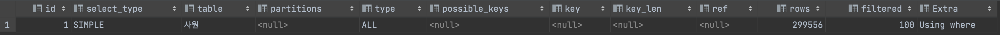
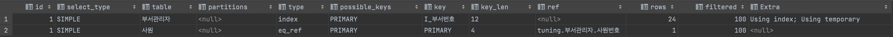
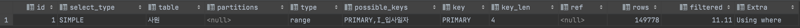

# 4장 악성 SQL 튜닝으로 초보자 탈출하기

## SQL 튜닝 준비하기


## SQL문 단순 수정으로 착한 쿼리 만들기

### 기본키를 변형하는 나쁜 SQL문

e.g. 사원번호가 1100으로 시작하고, 5자리 사원번호를 가지는 사원 찾기

**튜닝 전**

```sql
SELECT *
FROM 사원
WHERE SUBSTRING(사원번호, 1, 4) = 1100
AND LENGTH(사원번호) = 5
```



- 기본키를 가공하므로 table full scan을 한다.

**튜닝 후**

```sql
SELECT *
FROM 사원
WHERE 사원번호 >= 11000 AND 사원번호 <= 11009
```


- 기본키를 가공하지 않고 비교 연산자만 이용하므로 index range scan을 한다.
- BETWEEN문을 사용해도 된다.

### 사용하지 않는 함수를 포함하는 나쁜 SQL문

e.g. 성별 기준으로 몇 명의 사원이 있는지 조회하기

**튜닝 전**

```sql
SELECT IFNULL(성별, 'NO DATA') AS 성별, COUNT(1) 건수
FROM 사원
GROUP BY IFNULL(성별, 'NO DATA')
```


- index full scan을 한다.
- IFNULL 함수를 처리하기 위해서 DB 내부적으로 별도의 임시 테이블을 만들고 있다.

**튜닝 후**

```sql
SELECT 성별, COUNT(1) 건수
FROM 사원
GROUP BY 성별
```


- 성별 컬럼은 NOT NULL이고 M, F 외의 값이 오지는 않으므로 IFNULL을 사용할 필요가 없다.
- index full scan을 한다.
- 임시 테이블을 생성하지 않는다.

### 형변환으로 인덱스를 활용하지 못하는 나쁜 SQL문

- 내부적으로 형변환이 발생하는 경우에는 인덱스를 사용하더라도 쿼리 성능 저하가 발생할 수 있다.
- 날짜타입의 형변환을 조심하자.

e.g. 현재 유효한 급여 정보만 조회하기

**튜닝 전**

```sql
SELECT COUNT(1)
FROM 급여
WHERE 사용여부 = 1
```


- index full scan을 한다.
- filtered 항목이 10이므로 MySQL로 가져온 데이터 중 10%를 추출해서 최종 데이터를 출력한다. (506454 → 약 50000건 추출)

**튜닝 전 데이터 특성 확인하기**

```sql
SELECT 사용여부, COUNT(1)
FROM 급여
GROUP BY 사용여부
```


- 사용여부가 1인 데이터 건수는 전체 데이터 건수 대비 10% 이하이다.

```sql
show index from 급여
```


- 사용여부 열이 인덱스로 구성되어 있고, WHERE절 조건이 인덱스를 사용하도록 구성되었음에도 index full scan이 발생한다.
- 사용여부 열은 CHAR(1) 타입이므로 묵시적 형변환이 발생한 것이 원인이다.

**튜닝 후**

```sql
SELECT COUNT(1)
FROM 급여
WHERE 사용여부 = '1'
```


- 튜닝 전과 다르게 조건절이 스토리지 엔진에 전달되어 필요한 데이터만 가져왔다.
- 스토리지 엔진에서 100% 필터링 되어 MySQL 엔진에 가져온 것으로 확인된다.
- 묵시적 형변환이 발생해도 인덱스를 사용할 수는 있다. 하지만 테이블 DDL문을 수행해야 하고 DDL 수행시 데이터 잠김 현상으로 동시성 저하 문제가 발생할 수 있다.

### 열을 결합하여 사용하는 나쁜 SQL문

e.g. '성별 성' 컬럼을 합쳐 나온 결과가 'M Radwan'인 사원 찾기

**튜닝 전**

```sql
SELECT *
FROM 사원
WHERE CONCAT(성별, ' ', 성) = 'M Radwan'
```


- 컬럼을 가공하여 table full scan이 발생한다.

**튜닝 전 데이터 특성 확인하기**

```sql
SELECT '성별_성', COUNT(1)
FROM 사원
WHERE CONCAT(성별, ' ', 성) = 'M Radwan'

UNION ALL

SELECT '전체 데이터', COUNT(1)
FROM 사원;
```


- 조회하고자 하는 데이터의 수가 전체 데이터의 0.1% 미만이므로 인덱스 사용에 문제가 없다.
- 성별과 성으로 구성된 인덱스를 활용할 수 있다.

**튜닝 후**

```sql
SELECT *
FROM 사원
WHERE 성별 = 'M' AND 성 = 'Radwan'
```


- I_성별_성 인덱스를 통해 사원 테이블에 접근한다. 스토리지 엔진에서 모든 데이터를 필터링한다.

### 습관적으로 중복을 제거하는 나쁜 SQL문

e.g. 부서 관리자의 사원번호, 이름, 성, 부서번호 데이터를 중복 제거하여 찾기

**튜닝 전**

```sql
SELECT DISTINCT 사원.사원번호, 사원.이름, 사원.성, 부서관리자.부서번호
FROM 사원
JOIN 부서관리자
ON (사원.사원번호 = 부서관리자.사원번호)
```



- type이 index이므로 부서관리자의 사원번호 인덱스를 사용하여 조인시 index full scan을 한다.
- 사원 테이블의 type이 eq_ref이므로 사원번호 기본키를 사용하여 단 1건의 데이터를 조회하는 방식으로 조인된다.
- DISTINCT를 수행하기 위해 별도의 임시 테이블을 생성한다.

**튜닝 후**

```sql
SELECT 사원.사원번호, 사원.이름, 사원.성, 부서관리자.부서번호
FROM 사원
JOIN 부서관리자
ON (사원.사원번호 = 부서관리자.사원번호)
```


- 사원 테이블의 기본 키는 사원번호이므로 중복된 데이터가 없음이 보장되어 DISTINCT를 제거했다.
- DISTINCT 제거를 통해 임시테이블 생성을 방지할 수 있다.

### 다수 쿼리를 UNION 연산자로만 합치는 나쁜 SQL문

- 중복 제거시 선택도, 데이터 크기에 따라서 성능의 차이가 날 수도 있고, 나지 않을수도 있다.

**튜닝 전**

```sql
SELECT 'M' as 성별, 사원번호
FROM 사원
WHERE 성별 = 'M'
AND 성 = 'Baba'

UNION

SELECT 'F', 사원번호
FROM 사원
WHERE 성별 = 'F'
AND 성 = 'Baba'
```


- UNION한 두 쿼리 모두 I_성별_성 인덱스를 이용한다.
- UNION은 중복 제거 절차를 거치기 때문에 임시 테이블을 생성한다. 조회하는 데이터 수가 많았다면 메모리가 아닌 디스크에 임시 파일을 생성했을 것이다.
- 사원번호는 PK이므로 중복 제거 절차를 거칠 필요가 없다.

**튜닝 후**

```sql
SELECT 'M' as 성별, 사원번호
FROM 사원
WHERE 성별 = 'M'
AND 성 = 'Baba'

UNION ALL

SELECT 'F', 사원번호
FROM 사원
WHERE 성별 = 'F'
AND 성 = 'Baba'
```


- 중복을 제거할 필요가 없으므로 중복을 제거하지 않는다.

### 인덱스 고려 없이 열을 사용하는 나쁜 SQL문

e.g. 성과 성별이 같은 사람의 수를 카운트한다.

**튜닝 전**

```sql
SELECT 성, 성별, COUNT(1) as 카운트
FROM 사원
GROUP BY 성, 성별
```


- I_성별_성 인덱스를 사용하여 index full scan을 수행한다.
- I_성별_성 인덱스를 GROUP BY절에서 사용하므로 Using index(커버링 인덱스)로 수행한다.
- 그루핑하기 위해 임시 테이블을 생성한다.

**튜닝 후**

```sql
SELECT 성, 성별, COUNT(1) as 카운트
FROM 사원
GROUP BY 성별, 성
```


- GROUP 순서를 변경하여 임시 테이블을 만들지 않고 인덱스만으로 그루핑과 카운트가 가능해졌다.

### 엉뚱한 인덱스를 사용하는 나쁜 SQL문

e.g. 입사일자가 1989년이면서 사원번호가 100000이 넘는 사원을 조회한다.

**튜닝 전**

```sql
SELECT 사원번호
FROM 사원
WHERE 입사일자 LIKE '1989%'
AND 사원번호 > 100000
```



- PK인 사원번호와 입사일자 인덱스를 사용하여 조회한다.
- 사원번호 컬럼을 기준으로 index range scan을 수행한다.
- 스토리지 엔진에서 가져온 데이터 중 10%의 데이터만 실제 필요한 데이터이다. 즉, 많은 데이터가 필터링되지 않고 MySQL 엔진으로 전달되고 있다.

**튜닝 전 데이터 특성 확인하기**

```sql
SELECT COUNT(1)
FROM 사원
```


```sql
SELECT COUNT(1)
FROM 사원
WHERE 입사일자 LIKE '1989%'
```


```sql
SELECT COUNT(1)
FROM 사원
WHERE 사원번호 > 100000
```


- 사원번호 필터를 적용하면 전체 데이터 대비 약 70%를 가져온다.
- 입사일자 필터를 적용하면 전체 데이터 대비 약 10%를 가져온다.
- 즉, 입사일자를 필터 조건으로 사용해야 스토리지 엔진과 MySQL 엔진간 효율적인 데이터 전송이 가능하다.

**1차 튜닝 후**

```sql
SELECT 사원번호
FROM 사원 USE INDEX(I_입사일자)
WHERE 입사일자 LIKE '1989%'
AND 사원번호 > 100000
```


- 입사일자 인덱스를 사용하도록 명시적으로 지정했다.
- 스토리지 엔진으로부터 가져오는 데이터가 모두 필터링되었다.
- 인덱스 루스 스캔 (Using index for skip scan) 방식에 의해 인덱스를 스킵하는 오버헤드가 발생할 수 있다.
- SQL문 소요 시간이 튜닝 전과 크게 차이나지 않는다.

**2차 튜닝 후**

```sql
SELECT 사원번호
FROM 사원
WHERE 입사일자 >= '1989-01-01'
AND 입사일자 < '1990-01-01'
AND 사원번호 > 100000
```


- 입사일자가 date 타입이므로 부분검색 조건을 비교 연산자로 변경하였다.
- I_입사일자 인덱스로 index range scan을 수행한다. 이 때, 커버링 인덱스가 적용된다.

### 동등 조건으로 인덱스를 사용하는 나쁜 SQL문

e.g. B 출입문으로 출입한 이력이 있는 정보를 모두 조회

**튜닝 전**

```sql
SELECT *
FROM 사원출입기록
WHERE 출입문 = 'B'
```


- 출입문 인덱스를 사용하여 조회한다.
- 수행 결과가 약 30만건이다.
- 상수조건을 사용하므로 ref가 const이다.

**튜닝 전 데이터 특성 확인하기**

```sql
SELECT 출입문, COUNT(1)
FROM 사원출입기록
GROUP BY 출입문
```


- 전체 데이터 수가 660000건인데 수행 결과가 약 30만건으로 전체 데이터의 절반에 해당한다. 인덱스 사용시 실제 테이블에 접근하기 위해 랜덤 엑세스를 수행하여 성능 저하가 발생할 수 있다.

**튜닝 후**

```sql
SELECT *
FROM 사원출입기록 IGNORE INDEX(I_출입문)
WHERE 출입문 = 'B'
```


- table full scan을 수행한다. 다수 페이지에 시퀀셜 엑세스를 하므로 보다 효율적인 성능을 낸다.

### 범위 조건으로 인덱스를 사용하는 나쁜 SQL문

e.g. 입사일자가 1994년 1월 1일부터 2000년 12월 31일까지인 사원들의 이름과 성을 조회한다.

**튜닝 전**

```sql
SELECT 이름, 성
FROM 사원
WHERE 입사일자 BETWEEN STR_TO_DATE('1994-01-01', '%Y-%m-%d')
AND STR_TO_DATE('2000-12-31', '%Y-%m-%d')
```


- table full scan이 발생한다.
- 전체 데이터가 약 30만건, 조회 데이터가 약 5만건이므로 전체 데이터의 약 17%의 데이터를 가져온다.
- 접근하는 데이터 수가 많다면 table full scan을 사용하는 편이 나을 수 있다. → Using index condition, Using MMR을 통해 랜덤 액세스가 아닌 시퀀셜 액세스로 최적화되어 처리된다.
- 입사일자 열을 기준으로 매번 수 년에 걸친 데이터를 조회하는 경우가 잦다면, 테이블 풀 스캔을 고정적으로 사용하는 편이 나을 수 있다.

**튜닝 후**

```sql
SELECT 이름, 성
FROM 사원
WHERE 입사일자 BETWEEN '1994' AND '2000'
```


- 컬럼을 가공하여 입사일자 인덱스를 사용하지 못한다.

## 테이블 조인 설정 변경으로 착한 쿼리 만들기

### 작은 테이블이 먼저 조인에 참여하는 나쁜 SQL문

e.g. 부서 시작일자가 2002-03-01 이후인 사원의 사원번호와 부서번호를 조회한다.

**튜닝 전**

```sql
SELECT 매핑.사원번호, 부서.부서번호
FROM 부서사원_매핑 매핑, 부서
WHERE 매핑.부서번호 = 부서.부서번호
AND 매핑.시작일자 >= '2002-03-01'
```


**튜닝 전 데이터 특성 확인하기**

- 드라이빙 테이블인 부서 테이블과 드리븐 테이블인 부서사원_매핑 테이블간 중첩 루프 조인을 수행한다.
- 작은 크기의 부서 테이블에서 부서.부서번호 컬럼만 SELECT, WHERE절에 필요하므로 index full scan을 수행한다.
- 부서번호 컬럼만 사용하도록 인덱스 힌트를 추가하더라도 SQL이 개선되지는 않는다.
- 부서사원_매핑 테이블은 부서번호 인덱스로 index scan을 수행한다.

```sql
SELECT COUNT(1) FROM 부서사원_매핑
```

- 드리븐 테이블에서 약 4만건의 데이터를 랜덤 엑세스 하므로 비효율적이다. (드리븐 테이블 총 데이터 수: 약 33만건)

```sql
SELECT COUNT(1) FROM 부서사원_매핑 WHERE 시작일자 >= '2002-03-01'
```

- 매핑 테이블 필터링 후 총 데이터 수가 1,341 건이므로 매핑 테이블의 필터 조건을 먼저 적용하면 MySQL 엔진으로 가져오는 데이터 수가 적어져 효율적인 쿼리 수행이 가능하다.

**튜닝 후**

```sql
SELECT STRAIGHT_JOIN 매핑.사원번호, 부서.부서번호
FROM 부서사원_매핑 매핑, 부서
WHERE 매핑.부서번호 = 부서.부서번호
AND 매핑.시작일자 >= '2002-03-01'
```


- STRAIGHT_JOIN 힌트를 통해 FROM절에 작성된 테이블 순서대로 조인하도록 고정한다.
- 드라이빙 테이블이 튜닝 전과 반대로 매핑 테이블이 되었으며, 드리븐 테이블이 부서가 되었다.
- table full scan으로 드라이빙 테이블 데이터를 순차 접근하여 필터링 후 드리븐 테이블에 접근한다.
- 많은 양의 데이터를 랜덤 엑세스 하지 않아 성능이 개선되었다.

### 메인 테이블에 계속 의존하는 나쁜 SQL문

e.g. 사원번호가 450,000보다 크고 최대 연봉이 100,000보다 큰 데이터를 조회한다.

**튜닝 전**

```sql
SELECT 사원.사원번호, 사원.이름, 사원.성
FROM 사원
WHERE 사원번호 > 450000
AND (
	SELECT MAX(연봉)
	FROM 급여
	WHERE 사원번호 = 사원.사원번호
) > 100000
```


- FROM절 메인 테이블 사원에 접근하여 사원번호 기준으로 index range scan을 수행한다.
- 급여 테이블에 접근하는 서브쿼리는 외부 쿼리에 의존적인 DEPENDANT SUBQUERY이다.
- 급여 테이블은 사원번호 PK를 이용한다.

**튜닝 전 데이터 특성 확인하기**

```sql
SELECT COUNT(1) FROM 사원;
SELECT COUNT(1) FROM 급여;
```

- 사원 테이블 내 데이터는 약 30만건이 있다.
- 급여 테이블 내 데이터는 약 50만건이 있다.

```sql
SELECT COUNT(1)
FROM 사원
WHERE 사원번호 > 450000
```

- 사원번호가 450000을 초과하는 데이터는 49,999건으로 전체 데이터의 15% 수준이다.
- 서브쿼리 대신 조인으로 처리할 수 있는지 확인해봐야 한다.

**튜닝 후**

```sql
SELECT 사원.사원번호, 사원.이름, 사원.성
FROM 사원, 급여
WHERE 사원.사원번호 = 급여.사원번호
AND 사원.사원번호 > 450000
GROUP BY 사원.사원번호
HAVING MAX(급여.연봉) > 100000
```


- 드라이빙 테이블은 급여 테이블이고, 드리븐 테이블은 사원 테이블이다.
- 급여 테이블에 먼저 접근하기 위해 옵티마이저가 사원번호 필터링 조건을 `급여.사원번호 > 450000`으로 변경한다.
- DEPENDENT SUBQUERY가 제거되어 쿼리 성능이 개선되었다.

### 불필요한 조인을 수행하는 나쁜 SQL문

e.g. A 출입문으로 출입한 사원이 총 몇 명인지 구하는 쿼리. 인라인 뷰 사용

**튜닝 전**

```sql
SELECT COUNT(DISTINCT 사원.사원번호) AS 데이터건수
FROM 사원, (
	SELECT 사원번호
	FROM 사원출입기록 기록
	WHERE 출입문 = 'A'
) 기록
WHERE 사원.사원번호 = 기록.사원번호
```


[2021-09-12 15:57:42] [HY000][1003] /* select#1 */ select count(distinct `tuning`.`사원`.`사원번호`) AS `데이터건수` from `tuning`.`사원` join `tuning`.`사원출입기록` `기록` where ((`tuning`.`사원`.`사원번호` = `tuning`.`기록`.`사원번호`) and (`tuning`.`기록`.`출입문` = 'A'))

- 데이터 건수 150000건
- 인라인 뷰 조건절에서 인덱스와 상수를 동등 비교하므로 ref const
- 사원 테이블과 조인 조건으로 PK인 사원번호를 이용하므로 eq_ref
- 인라인 뷰는 옵티마이저에 의해 조인 방식이 뷰 병합으로 최적화되어 실제로는 다음과 같이 수행된다.

```sql
SELECT COUNT(DISTINCT 사원.사원번호) AS 데이터건수
FROM 사원, 사원출입기록
WHERE 사원.사원번호 = 사원출입기록.사원번호
AND 출입문 = 'A'
```

- 출입한 사원의 수를 구하는 쿼리는 카운트 할 필요 없이 존재 여부만 확인하면 된다.

**튜닝 후**

```sql
SELECT COUNT(1) AS 데이터건수
FROM 사원
WHERE EXISTS(
	SELECT 1
	FROM 사원출입기록 기록
	WHERE 출입문 = 'A'
	AND 기록.사원번호 = 사원.사원번호
)
```


- 출입 여부만 판단하므로 카운트 할 필요가 없어 EXISTS 구문을 사용한다.
- 출입문 A에 관한 기록이 있는 사원번호에 대해 조인을 한 뒤, 해당하는 데이터만 집계한다.
- <subquery2>는 id가 2인 사원출력기록 테이블이다.
- 사원출입기록 테이블은 EXISTS 연산자로 데이터 존재 여부를 판단하기 위해 임시 테이블을 생성하는 MATERIALIZED로 표기된다.
