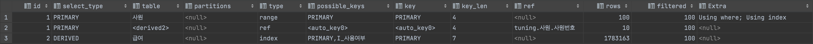

# 5장 악성 SQL 튜닝으로 전문가 되기

## SQL문 재작성으로 착한 쿼리 만들기

쿼리의 조인 방식, 서브쿼리 형태, 조인 조건절 등을 변경하여 튜닝하는 방법에 대해 설명한다.

### 처음부터 모든 데이터를 가져오는 나쁜 SQL문

e.g. 사원번호가 10001~10100사이인 사원들의 평균 연봉, 최고 연봉, 최저 연봉을 구하시오.

**튜닝 전**

```sql
SELECT 사원.사원번호,
       급여.평균연봉,
       급여.최고연봉,
       급여.최저연봉
FROM 사원,
     (
         SELECT 사원번호,
                ROUND(AVG(연봉), 0) 평균연봉,
                ROUND(MAX(연봉), 0) 최고연봉,
                ROUND(MIN(연봉), 0) 최저연봉
         FROM 급여
         GROUP BY 사원번호
     ) 급여
WHERE 사원.사원번호 = 급여.사원번호
  AND 사원.사원번호 BETWEEN 10001 AND 10100;

/* [2021-09-19 16:29:38] 100 rows retrieved starting from 1 in 1 s 795 ms (execution: 1 s 670 ms, fetching: 125 ms) */
```



- `사원` 테이블이 driving table, 인라인 뷰인 `<derived2>` 테이블이 driven table로 nested loop join을 수행한다.
- `<derived2>` 테이블은 메모리 또는 디스크 위에 적재된다.

**분석**

- FROM절 내 급여 테이블을 grouping하면서 index full scan을 수행하는데, 1,783,163개의 데이터에 접근하므로 대부분의 데이터에 접근하여 random access로 인한 효율성 저하가 발생한다.

```sql
SELECT COUNT(1) FROM 사원; /* 300024 */
SELECT COUNT(1) FROM 사원 WHERE 사원번호 BETWEEN 10001 AND 10100; /* 100 */
```

- `사원` 전체 테이블은 약 30만건이지만, 범위 조건 필터링을 한 데이터의 수는 100건이므로 사원을 기준으로 먼저 필터링이 적용되는 것이 효율적임을 알 수 있다.

**튜닝 후**

```sql
SELECT 사원.사원번호,
       (SELECT ROUND(AVG(연봉), 0)
        FROM 급여 as 급여1
        WHERE 사원번호 = 사원.사원번호
       ) AS 평균연봉,
       (SELECT ROUND(MAX(연봉), 0)
        FROM 급여 as 급여2
        WHERE 사원번호 = 사원.사원번호
       ) AS 최고연봉,
       (SELECT ROUND(MIN(연봉), 0)
        FROM 급여 as 급여3
        WHERE 사원번호 = 사원.사원번호
       ) AS 최저연봉
FROM 사원
WHERE 사원.사원번호 BETWEEN 10001 AND 10100;

/* [2021-09-19 17:20:48] 100 rows retrieved starting from 1 in 73 ms (execution: 16 ms, fetching: 57 ms) */
```


- `사원` 테이블에 가장 먼저 접근하여 100건으로 필터링 후, `급여1`, `급여2`, `급여3` 테이블 순으로 접근하여 매번 3개의 스칼라 서브쿼리를 수행한다.

### 비효율적인 페이징을 수행하는 나쁜 SQL문

e.g. 사원번호가 10001~50000사이인 사원들을 연봉 합계 기준으로 내림차순하여 15페이지 데이터 10건을 가져온다. (=150번째 데이터부터 10건을 가져온다.)

**튜닝 전**

```sql
SELECT 사원.사원번호, 사원.이름, 사원.성, 사원.입사일자
FROM 사원,
     급여
WHERE 사원.사원번호 = 급여.사원번호
  AND 사원.사원번호 BETWEEN 10001 AND 50000
GROUP BY 사원.사원번호
ORDER BY SUM(급여.연봉) DESC
LIMIT 150, 10;
/* [2021-09-19 17:26:59] 10 rows retrieved starting from 1 in 416 ms (execution: 385 ms, fetching: 31 ms) */
```


- `사원` 테이블을 driving table, `급여` 테이블을 driven table로 접근한다.
- `사원` 테이블은 그루핑과 정렬을 위해 임시 테이블을 생성한 뒤 정렬을 수행한다. (Using temporary; Using filesort)

**분석**

- LIMIT 연산으로 가져오는 결과는 10건이기 때문에 정렬된 데이터를 가져온 후에 조인하여 결과를 출력하는 편이 효율적이다.
- 그루핑과 정렬때문에 임시 테이블 생성은 필연적이므로 인라인 뷰를 사용해도 무방하다.

**튜닝 후**

```sql
SELECT 사원.사원번호, 사원.이름, 사원.성, 사원.입사일자
FROM (SELECT 사원번호
      FROM 급여
      WHERE 사원번호 BETWEEN 10001 AND 50000
      GROUP BY 사원번호
      ORDER BY SUM(급여.연봉) DESC
      LIMIT 150,10) 급여,
     사원
WHERE 사원.사원번호 = 급여.사원번호;
/* [2021-09-19 17:33:46] 10 rows retrieved starting from 1 in 144 ms (execution: 123 ms, fetching: 21 ms) */
```


- `<drived2>` 테이블은 튜닝 전 쿼리와 마찬가지로 임시 테이블을 생성하여 그루핑과 정렬을 수행한다.
- driving table인 `<drived2>` 테이블과 driven table인 `사원` 테이블간에 nested loop join을 수행한다.
- 조인시 `<derived2>` 테이블은 임시 테이블이므로 테이블 풀 스캔을 한다. 임시 테이블의 row 수는 10개이므로 문제가 되지 않는다.
- 사원 테이블 접근시 `eq_ref`(기본키)로 접근하므로 중첩 루프 조인시 row당 한 건의 데이터만 가져온다.

### 필요 이상으로 많은 정보를 가져오는 나쁜 SQL문

e.g. 사원번호가 300000보다 큰 사원 중 남성의 수를 출력한다.

**튜닝 전**

```sql
SELECT COUNT(사원번호) AS 카운트
FROM (
         SELECT 사원.사원번호, 부서관리자.부서번호
         FROM (SELECT *
               FROM 사원
               WHERE 성별 = 'M'
                 AND 사원번호 > 300000
              ) 사원
                  LEFT JOIN 부서관리자
                            ON 사원.사원번호 = 부서관리자.사원번호
     ) 서브쿼리;

/* [2021-09-19 18:00:12] 1 row retrieved starting from 1 in 1 s 122 ms (execution: 1 s 71 ms, fetching: 51 ms) */
```


- `사원` 테이블이 driving table, `부서관리자` 테이블이 driven table이다.
- `사원` 조회시 index full scan을 수행한다.
- nested loop join시 PK를 이용하여 1건의 데이터에 접근한다.

**분석**

- 부서관리자 테이블 내 어떠한 컬럼에도 접근하지 않으므로 불필요한 조인을 수행하고 있는 것이다.

**튜닝 후**

```sql
SELECT COUNT(사원번호) as 카운트
FROM 사원
WHERE 성별 = 'M'
  AND 사원번호 > 300000;

/* [2021-09-19 18:12:36] 1 row retrieved starting from 1 in 90 ms (execution: 56 ms, fetching: 34 ms) */
```


- 불필요한 조인이 제거되었다.
- 조인 제거에 따라 사원 테이블 내 약 5만건의 row에만 접근하므로 데이터 접근량이 1/3으로 줄어들었다.

### 대량의 데이터를 가져와 조인하는 나쁜 SQL문

e.g. 사원과 부서 관리자가 존재하는 부서의 부서 번호를 중복 없이 정렬하여 출력한다.

**튜닝 전**

```sql
SELECT DISTINCT 매핑.부서번호
  FROM 부서관리자 관리자,
       부서사원_매핑 매핑
 WHERE 관리자.부서번호 = 매핑.부서번호
 ORDER BY 매핑.부서번호;

/* [2021-09-19 18:21:48] 9 rows retrieved starting from 1 in 1 s 575 ms (execution: 1 s 550 ms, fetching: 25 ms) */
```


- `부서사원_매핑` 테이블에 index full scan으로 접근한다.
- `매핑` 테이블 접근시 중복을 제거하기 위해 임시 테이블을 생성한다.
- driving table인 `부서사원_매핑` 테이블과 driven table인 `부서관리자` 테이블 간 nested loop join을 수행한다.

**분석**

- 두 테이블에 접근하여 부서번호가 같은지 일일히 확인할 필요가 없이 단순히 부서번호가 존재하는지 여부만 확인하면 된다.
- 매핑 테이블 내 데이터의 수가 수십만건이므로 미리 중복 필터링을 거치면 조인 효율성이 좋아질 수 있다.

**튜닝 후**

```sql
SELECT 매핑.부서번호
FROM (SELECT DISTINCT 부서번호
      FROM 부서사원_매핑 매핑
     ) 매핑
WHERE EXISTS(SELECT 1
             FROM 부서관리자 관리자
             WHERE 부서번호 = 매핑.부서번호)
ORDER BY 매핑.부서번호;

/* [2021-09-19 18:29:44] 9 rows retrieved starting from 1 in 53 ms (execution: 13 ms, fetching: 40 ms) */
```


- driving table인 `부서관리자` 테이블과 driven table인 `<derived2>` 테이블 간 조인한다.
- `부서관리자` 테이블은 24개의 데이터를 index full scan을 수행한 후 중복 제거된 `<derived2>` 테이블과 조인할 때 EXISTS 연산을 통해 비교할 부서번호가 있는지 확인한다. (LooseScan)
- `매핑` 테이블에서 중복되는 부서 번호를 미리 필터링하고 난 후에 `부서관리자` 테이블에 존재하는지 여부를 파악한다.
- `매핑` 테이블에서 인덱스로 정렬 후 중복을 제거한다. (Using index for group-by)

## 인덱스 조정으로 착한 쿼리 만들기

이미 존재하는 인덱스를 변경하거나 삭제 또는 신규로 추가하는 방식으로 비효율적인 쿼리를 튜닝하는 방법에 대해 설명한다.

### 인덱스 없이 작은 규모의 데이터를 조회하는 나쁜 SQL문

e.g. 이름이 Georgi이고 성이 Wielonsky인 사원 정보를 출력한다.

**튜닝 전**

```sql
SELECT *
FROM 사원
WHERE 이름 = 'Georgi'
  AND 성 = 'Wielonsky';

/* [2021-09-19 19:16:02] 1 row retrieved starting from 1 in 257 ms (execution: 155 ms, fetching: 102 ms) */
```


- table full scan을 수행한다.

**분석**

- `이름`과 `성` 중에서 더 다양한 값이 들어있는 컬럼을 선두 열로 선택하여 인덱스를 생성한다.

```sql
SELECT COUNT(DISTINCT (이름)) 이름_개수, COUNT(DISTINCT (성)) 성_개수, COUNT(1) 전체
FROM 사원;

/* | 이름_개수 | 성_개수 | 전체     | */
/* | 1275    | 1637  | 300024 | */
```

- `성_개수`의 고유한 값이 더 많으므로 성 + 이름을 조합한 `I_사원_성_이름` 인덱스를 생성한다.

```sql
ALTER TABLE 사원
ADD INDEX I_사원_성_이름 (성,이름);

/* [2021-09-19 19:21:35] completed in 1 s 850 ms */
```

**튜닝 후**

```sql
SELECT *
FROM 사원
WHERE 이름 = 'Georgi'
  AND 성 = 'Wielonsky';

/* [2021-09-19 19:21:56] 1 row retrieved starting from 1 in 56 ms (execution: 11 ms, fetching: 45 ms) */
```


- 새로 생성한 인덱스를 사용하여 조회한다.
- 스토리지 엔진으로부터 모든 값을 필터링한다.

**원상복원**

- 다음 예제 실행을 위해 인덱스를 제거한다.

```sql
ALTER TABLE 사원 DROP INDEX I_사원_성_이름;
```

### 인덱스를 하나만 사용하는 나쁜 SQL문

e.g. 이름이 Matt이거나 입사일자가 1987-03-31일인 사원 정보를 조회한다.

**튜닝 전**

```sql
SELECT *
  FROM 사원
 WHERE 이름 = 'Matt'
    OR 입사일자 = '1987-03-31';

/* [2021-09-19 19:25:41] 343 rows retrieved starting from 1 in 195 ms (execution: 134 ms, fetching: 61 ms) */
```


- table full scan을 수행한다.
- MySQL 엔진에서 WHERE절의 모든 조건을 필터링한다.
- 스토리지 엔진으로부터 데이터를 가져와 실제 사용되는 row는 약 300건이다.

**분석**

```sql
SELECT COUNT(1) FROM 사원; /* 300024 */
SELECT COUNT(1) FROM 사원 WHERE 이름 = 'Matt'; /* 233 */
SHOW INDEX FROM 사원;
```

- 소량의 데이터를 가져올 때에는 table full scan보다 index scan이 효율적이다.
- possible_keys 또는 인덱스 조회를 통해 알 수 있듯이 `I_입사일자` 인덱스를 이용할 수 있지만 `이름` 인덱스는 존재하지 않으므로 `이름` 인덱스를 추가하여 효율성을 개선할 수 있다.

```sql
ALTER TABLE 사원
ADD INDEX I_이름(이름);

/* [2021-09-19 19:33:19] completed in 1 s 89 ms */
```

**튜닝 후**

```sql
SELECT *
FROM 사원
WHERE 이름 = 'Matt'
   OR 입사일자 = '1987-03-31';

/* [2021-09-19 19:33:45] 343 rows retrieved starting from 1 in 61 ms (execution: 15 ms, fetching: 46 ms) */
```


- 두개의 조건이 각각 인덱스로 수행된 후에 결과가 병합된다. (Using union)
- 조건절이 동등 조건(=)이 아니라 범위 조건이라면 index_merge로 처리되지 않을 수 있다.
- MySQL 버전에 따라 내부 매커니즘에 차이가 있을 수 있으므로 실행계획을 확인한 후에 UNION 또는 UNION ALL구문으로 분리하는 것을 고려해야 한다.

**원상복원**

- 다음 예제 실행을 위해 인덱스를 제거한다.

```sql
ALTER TABLE 사원
DROP INDEX I_이름;
```

### 큰 규모의 데이터 변경으로 인덱스에 영향을 주는 나쁜 SQL문

e.g. 'B'로 설정된 출입문을 모두 'X'로 변경한다.

**튜닝 전**

```sql
SET autocommit = 0;
SELECT @@autocommit;
```

```sql
UPDATE 사원출입기록
SET 출입문 = 'X'
WHERE 출입문 = 'B';

/* [2021-09-19 19:41:56] 300,000 rows affected in 19 s 244 ms */
```


- 튜닝 전 SQL문은 UPDATE문이므로 별도의 설정을 하지 않으면 바로 자동 저장된다.
- 반복되는 UPDATE문을 수행할 때 자동 저장되는 커밋 설정을 접속한 세션에 한해 저동 저장되지 않도록 처리한다.
- 기본 키로 `사원출입기록` 테이블 접근 후 출입문이 'B'인 데이터만 'X'로 업데이트 한다.
- 인덱스를 사용하여 약 65만개의 데이터에 접근하여 변경한다.

**분석**

- UPDATE문은 수정할 데이터에 접근한 후에 SET절의 수정값으로 변경하므로 인덱스 존재 여부가 중요하다.
- 조회한 데이터를 변경하는 범위에는 테이블 뿐만 아니라 인덱스도 포함되므로, 인덱스가 많은 테이블의 데이터 변경시에는 성능적으로 불리하다.

```sql
SHOW INDEX FROM 사원출입기록;
```


- 출입문에 인덱스가 존재하는데, 카디널리티가 2이므로 효용성이 떨어진다.
- 사원출입기록 테이블과 같은 히스토리를 쌓는 테이블에서는 보통 데이터 INSERT 작업 위주로 이루어지므로 인덱스의 활용도가 떨어진다면 제거하는 편이 낫다.
- 인덱스 제거 후 성능 테스트를 하기 위해 UPDATE문을 rollback 후 인덱스를 제거한다.

```sql
ROLLBACK;

ALTER TABLE 사원출입기록
DROP INDEX I_출입문;

/* [2021-09-19 19:51:10] completed in 105 ms */
```

**튜닝 후**

```sql
UPDATE 사원출입기록
SET 출입문 = 'X'
WHERE 출입문 = 'B';

/* [2021-09-19 19:52:07] 300,000 rows affected in 3 s 432 ms */
```


- 인덱스를 제거한 것이므로 실행계획상의 차이는 없다.

**원상복원**

- 다음 예제 실행을 위해 롤백한다.

```sql
ROLLBACK;
SET autocommit=1;
```

### 비효율적인 인덱스를 사용하는 나쁜 SQL문

e.g. 사원 테이블에서 성별이 M이고 성이 Baba인 정보를 출력한다.

**튜닝 전**

```sql
SELECT 사원번호, 이름, 성
FROM 사원
WHERE 성별 = 'M'
  AND 성 = 'Baba';

/* [2021-09-19 20:08:20] 135 rows retrieved starting from 1 in 50 ms (execution: 11 ms, fetching: 39 ms) */
```


- `I_성별_성` 인덱스를 통해 접근한다.
- 스토리지 엔진에서 인덱스 스캔을 통해 데이터를 모두 필터링하여 가져온다.

```sql
SELECT COUNT(DISTINCT 성) 성_개수, COUNT(DISTINCT 성별) 성별_개수  
FROM 사원 ;

/* | 1637 | 2 | */
```

**분석**

- 성 컬럼 데이터는 1637건, 성별 컬럼은 2건이다.
    - 성별 컬럼은 카디널리티가 2이기 때문에 인덱스의 선두로 사용하기 적합하지 않다.
    - 현재 실행 계획이나 수행 결과상으로는 크게 문제가 되지 않으나 데이터가 늘어날 경우 문제가 발생할 수 있다.
- 인덱스 생성 선두를 바꿔 `I_성_성별` 인덱스를 생성하고 기존 인덱스는 제거한다.

```sql
ALTER TABLE 사원
DROP INDEX I_성별_성,
ADD INDEX I_성_성별(성, 성별);

/* [2021-09-19 20:05:44] completed in 1 s 394 ms */
```

**튜닝 후**

```sql
SELECT 사원번호, 이름, 성
FROM 사원
WHERE 성별 = 'M'
  AND 성 = 'Baba';

/* [2021-09-19 20:06:39] 135 rows retrieved starting from 1 in 49 ms (execution: 12 ms, fetching: 37 ms) */
```


- 실행계획은 새로 생성한 인덱스를 타는 것으로 바뀌었다. 큰 차이는 없어보이나 데이터 양이 많아지면 인덱스로 인한 성능 향상을 기대할 수 있다.

**원상복원**

- 다음 예제 실행을 위해 인덱스를 재설정한다.

```sql
ALTER TABLE 사원
DROP INDEX I_성_성별,
ADD INDEX I_성별_성(성별, 성);
```

## 적절한 테이블 및 컬럼 속성 설정으로 착한 쿼리 만들기

- 물리적으로 존재하는 테이블 및 컬럼 속성을 변경하여 쿼리의 성능을 높이는 방법에 대해 설명한다.

### 잘못된 컬럼 속성으로 비효율적으로 작성한 나쁜 SQL문

e.g. 부서 테이블의 비고 컬럼 값이 소문자 'active'일 때 데이터를 조회한다.

**튜닝 전**

```sql
SELECT 부서명, 비고
  FROM 부서
 WHERE 비고 = 'active'
   AND ASCII(SUBSTR(비고,1,1)) = 97
   AND ASCII(SUBSTR(비고,2,1)) = 99;
```


**분석**

```sql
SELECT 부서명, 비고
FROM 부서
WHERE 비고 = 'active';
```

- 대소문자가 섞인 데이터가 7건 출력된다.

```sql
SELECT 비고, 
       SUBSTR(비고,1,1) 첫번째, 
       ASCII(SUBSTR(비고,1,1)) 첫번째_아스키, 
	   SUBSTR(비고,2,1) 두번째,
       ASCII(SUBSTR(비고,2,1)) 두번째_아스키
FROM 부서
WHERE 비고 = 'active';
```


```sql
SELECT COLUMN_NAME, collation_name
FROM information_schema.COLUMNS
WHERE table_schema = 'tuning'
AND TABLE_NAME = '부서';
```

- 현재 컬럼에 사용중인 문자열 콜레이션은 `utf8_general_ci`이므로 대소문자를 구분하지 않는다.
- 대소문자를 구분하지 않는 콜레이션을 사용하므로 엄격하게 구분하기 위해서는 콜레이션을 변경해야 한다.

```sql
ALTER TABLE 부서
CHANGE COLUMN 비고 비고 VARCHAR(40) NULL DEFAULT NULL COLLATE 'UTF8MB4_bin';
```

- 기존 `utf8_general_ci`에 이모지까지 지원하는 `UTF8MB4_bin`로 변경하였다.
- 튜닝 전 SQL문에서 `substr()`, `ascii()`를 사용하지 않고도 대소문자를 구분할 수 있다.

**튜닝 후**

```sql
SELECT 부서명, 비고
FROM 부서
WHERE 비고 = 'active';
```

- 결과에 대소문자가 섞인 row가 나오지 않는다.

**원상복원**

```sql
ALTER TABLE 부서
CHANGE COLUMN 비고 비고 VARCHAR(40) NULL DEFAULT NULL COLLATE 'utf8_general_ci';

/* [2021-09-19 20:25:16] [HY000][3778] 'utf8_general_ci' is a collation of the deprecated character set UTF8MB3. Please consider using UTF8MB4 with an appropriate collation instead. */
```

- 기존 콜레이션으로 변경하면 경고가 발생하지만 무시한다.

### 대소문자가 섞인 데이터와 비교하는 나쁜 SQL문

e.g. 사원 테이블에서 입사일자가 1990년 이후이고 이름이 MARY인 사원 정보를 출력한다.

**튜닝 전**

```sql
SELECT 이름, 성, 성별, 생년월일
FROM 사원
WHERE LOWER(이름) = LOWER('MARY')
AND 입사일자 >= STR_TO_DATE('1990-01-01', '%Y-%m-%d');

/* [2021-09-19 20:26:46] 96 rows retrieved starting from 1 in 1 s 761 ms (execution: 1 s 742 ms, fetching: 19 ms) */
```


- 조건문에 이름과 입사일자가 명시되어 있지만 `LOWER()` 함수를 통해 컬럼을 가공하므로 인덱스를 활용하지 못하고 ALL로 동작한다.

**분석**

```sql
SELECT COUNT(1) 
FROM 사원; /* 300024 */

SELECT COUNT(1)
FROM 사원
WHERE 입사일자 >= STR_TO_DATE('1990-01-01', '%Y-%m-%d'); /*135227 */

SELECT COUNT(1)
FROM 사원
WHERE LOWER(이름) = LOWER('MARY'); /* 224 */
```

- 입사일자 조건은 전체 데이터의 43% 데이터가 존재하므로 인덱스를 활용할 수 없다.
- 이름 조건은 224건만 존재하므로 매우 적은 데이터에 접근한다.

```sql
SELECT COLUMN_NAME, collation_name
FROM information_schema.columns
WHERE TABLE_NAME='사원'
AND table_schema='tuning';
```


- 이름 조건에 인덱스를 적용하고 싶지만, 정확히 MARY와 일치하는 값은 없어 소문자로 변환해야 한다.
- 위 예제와 반대로 'utf8_general_ci'를 적용하면 인덱스 적용시에도 대소문자 구분을 하지 않는다.

```sql
ALTER TABLE 사원 
ADD COLUMN 소문자_이름 VARCHAR(14) NOT NULL AFTER 이름;

SET SQL_SAFE_UPDATES = 0;

UPDATE 사원
SET 소문자_이름 = LOWER(이름);

ALTER TABLE 사원 ADD INDEX I_소문자이름(소문자_이름);
```

- WHERE절 없이 UPDATE문 수행시 에러가 발생할 수 있는데, SQL_SAFE_UPDATES 플래그를 off하면 수행 가능하다.

**튜닝 후**

```sql
SELECT 이름, 성, 성별, 생년월일
FROM 사원
WHERE 소문자_이름= 'MARY'
AND 입사일자 >= '1990-01-01';

/* [2021-09-19 20:41:41] 96 rows retrieved starting from 1 in 40 ms (execution: 20 ms, fetching: 20 ms) */
```


- 소문자 이름 컬럼의 인덱스를 사용하여 접근한다.
- 중복 컬럼이 생성되면 용량이 낭비되는 것으로 보일 수 있지만, 인덱스를 활용하여 쿼리를 튜닝할 수 있다.

**원상복원**

```sql
ALTER TABLE 사원 DROP COLUMN 소문자_이름;

SET SQL_SAFE_UPDATES = 1;
```

### 분산 없이 큰 규모의 데이터를 사용하는 나쁜 SQL문

e.g. 급여 테이블에서 시작일자가 2000-01-01~2000-12-31일 데이터를 모두 집계한다.

**튜닝 전**

```sql
SELECT COUNT(1)
FROM 급여
WHERE 시작일자 BETWEEN STR_TO_DATE('2000-01-01', '%Y-%m-%d')
          AND STR_TO_DATE('2000-12-31', '%Y-%m-%d');

/* [2021-09-19 20:46:08] 1 row retrieved starting from 1 in 678 ms (execution: 659 ms, fetching: 19 ms) */
```


**분석**

```sql
SELECT COUNT(1)
FROM 급여; /* 2844047 */

SELECT COUNT(1)
FROM 급여
WHERE 시작일자 BETWEEN STR_TO_DATE('2000-01-01', '%Y-%m-%d')
          AND STR_TO_DATE('2000-12-31', '%Y-%m-%d'); /* 255785 */
```

- 요구사항이 전체 데이터의 10%가량을 조회한다.

```sql
SELECT YEAR(시작일자), COUNT(1)
FROM 급여
GROUP BY YEAR(시작일자);
```


- 연단위 데이터 편차가 다소 있지만 골고루 분포되어 있다.
- 월 또는 연 단위 데이터 조회가 빈번히 발생하는 경우 시작일자를 기준으로 테이블을 파티셔닝 할 수 있다.

```sql
ALTER TABLE 급여
partition by range COLUMNS (시작일자)
(
    partition p85 values less than ('1985-12-31'),
    partition p86 values less than ('1986-12-31'),
    partition p87 values less than ('1987-12-31'),
    partition p88 values less than ('1988-12-31'),
    partition p89 values less than ('1989-12-31'),
    partition p90 values less than ('1990-12-31'),
    partition p91 values less than ('1991-12-31'),
    partition p92 values less than ('1992-12-31'),
    partition p93 values less than ('1993-12-31'),
    partition p94 values less than ('1994-12-31'),
    partition p95 values less than ('1995-12-31'),
    partition p96 values less than ('1996-12-31'),
    partition p97 values less than ('1997-12-31'),
    partition p98 values less than ('1998-12-31'),
    partition p99 values less than ('1999-12-31'),
    partition p00 values less than ('2000-12-31'),
    partition p01 values less than ('2001-12-31'),
    partition p02 values less than ('2002-12-31'),
    partition p03 values less than (MAXVALUE)
);
```

**튜닝 후**

```sql
SELECT COUNT(1)
FROM 급여
WHERE 시작일자 BETWEEN STR_TO_DATE('2000-01-01', '%Y-%m-%d')
AND STR_TO_DATE('2000-12-31', '%Y-%m-%d');

/* [2021-09-19 20:53:31] 1 row retrieved starting from 1 in 125 ms (execution: 109 ms, fetching: 16 ms) */
```


- 범위 파티션을 설정하여 데이터가 존재하는 파티션에만 접근하므로 쿼리의 효율성이 개선되었다.

**원상복원**

```sql
ALTER TABLE 급여 REMOVE PARTITIONING;
```